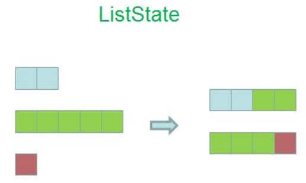
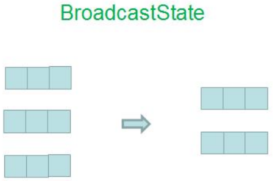
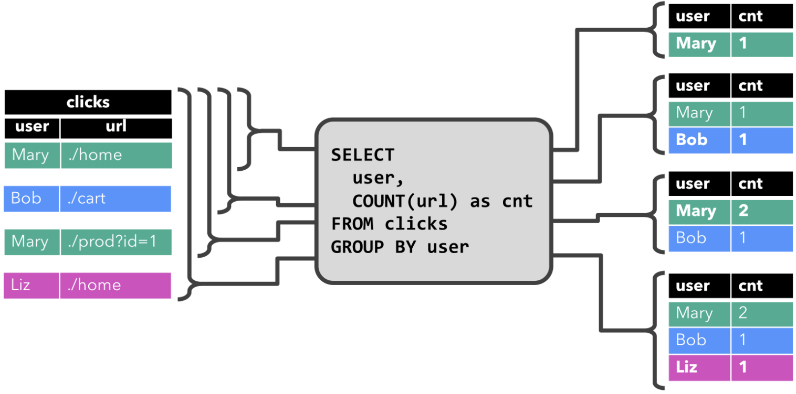
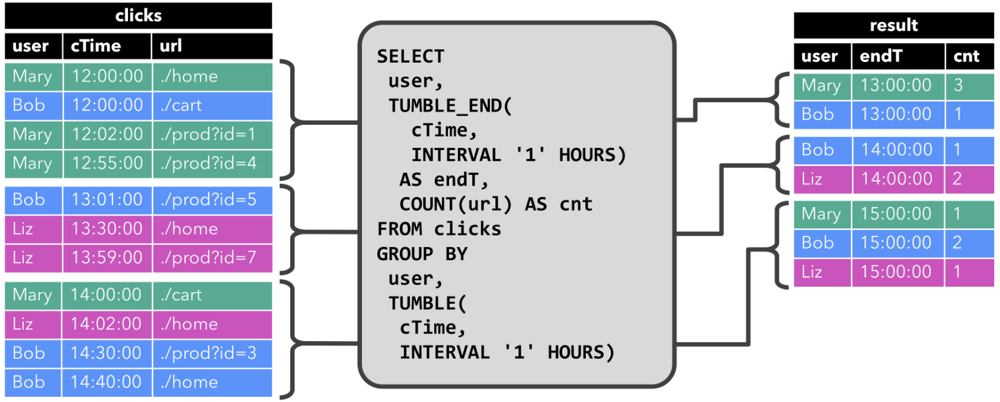
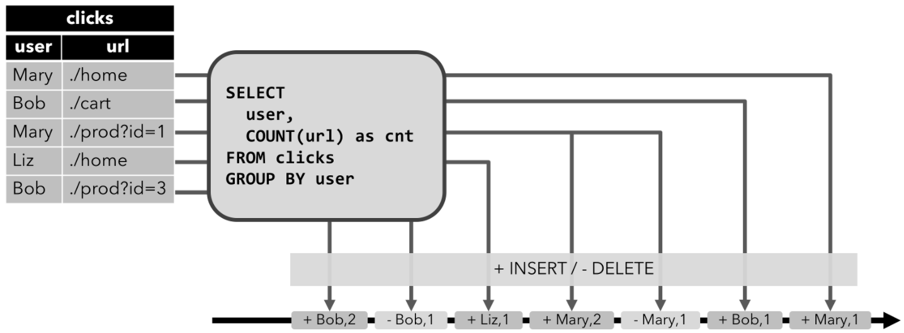
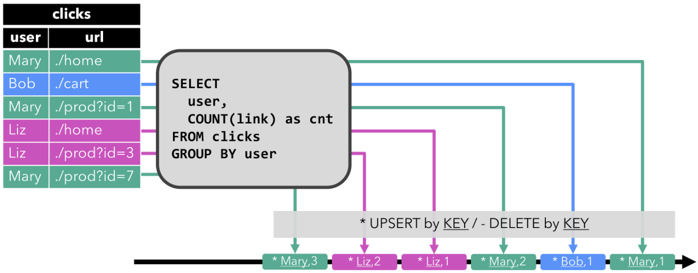
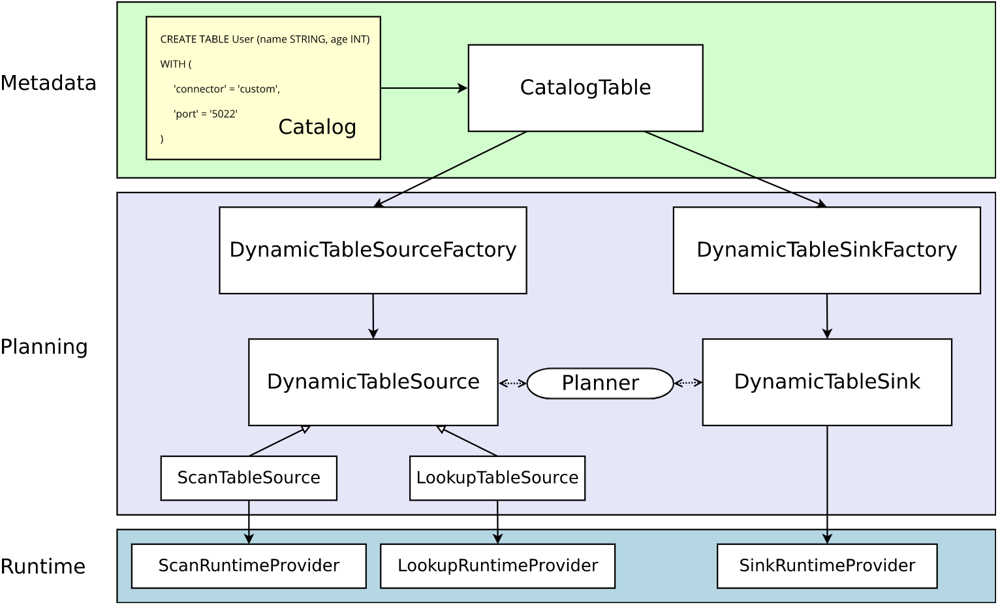

@author 虞祥


# 1. Flink核心概念和编程模型

## 1.1 flink生态的核心组件栈的分层


## 1.2 flink api的分层

SQL -> High-Level Language

table api  ->  declarative DSL

DataStream/DataSet  ->  core APIs

Stateful Stream Processing  ->  Low-level building block(stream, state, event time)

注意：

（1） 越底层API越灵活，越往上层API越轻便

（2） SQL的必定存在解析，和专称mr的过程，必定有性能损失

（3） SQL构建在table上，相当于是一章虚拟表

（4） 不同类型的table构建在不痛的table环境

（5） table可以和DataStream或DataSet互相转换

（6） streaming sql不同于存储的sql，最终会变成流式执行计划


## 1.3 DataFlow的基本套路


1. 构建安装环境，stream或batch
2. 创建source
3. 对数据transformations
4. 输出结果sink


## 1.4 并行化DataFlow


实际上在设置并行度后，算子会并行运行。


## 1.5 数据的传递

one-to-one：同spark的单依赖

多依赖：

1. 改变流的分区
2.  重新分区策略取决于使用算子

keyby() -> repartition by hash key，根据hash key来发给分区

broadcast -> 给每个机器都发一份

rebalance() -> repartition randomly


## 1.6 windows

1. windows将流分割成小块用于计算。主要分成**Keyed Windows**和**Non-Keyed Windows**

2. windows的生命周期

- 创建：当窗口的第一个元素到达时，创建窗口
- 销毁：当时间（EventTime/ProcessingTime）超过了【窗口最大时间+允许延迟时间】，窗口清除。例如定义5分钟窗口，允许延迟1分钟，那么12:06:01时刻会清除12:00:00-12:06:00的窗口
- 触发器Trigger：设定条件，指定Windows在什么条件下触发。触发器还可以在Windows生命周期内删除窗口内数据（注意不会清除元数据，数据依然可以进入窗口）
- Windows Function：作用于Windows的处理逻辑
- 驱逐器Evictor：相当于Filter，过滤窗口中的数据。分为触发后，在计算前过滤和在计算后过滤。

3. Keyed Windows和Non-Keyed Windows

- 从直观上看，有keyBy是Keyed Windows，没有就是Non-Keyed Windows
- Keyed Windows允许并行执行任务，相同key的元素会被发送到同一个task
- Non-Keyed Windows所有元素会在一个task中，并行度1

4. Windows Assigners

windows Assigners定义了元素如何分配到一个窗口或多个。代码中是window(...)/windowAll()中调用决定WindowAssigner

- count windows

   根据消息的条数来划分的窗口

- Time windows

   `Tumbling window` 翻滚窗口

   

   `Sliding window` 滑动窗口

   

   `Session Window` 

   `Globle window`：所有相同key的element会被分配到同一个globle window，默认trigger是NeverTrigger，所以用户必须自定义触发器，否则不会进行任何计算

   

- 自定义window

5. 触发器 Trigger

- 触发器决定窗口中的数据何时被处理
- 每个windowAssginer都实现了触发器，如果默认触发器不能满足需求可以自定义
- 触发器状态：

```java
/**
	 * No action is taken on the window.
	 * 不操作
	 */
	CONTINUE(false, false),

	/**
	 * {@code FIRE_AND_PURGE} evaluates the window function and emits the window
	 * result.
	 * 触发计算后清除window中数据
	 */
	FIRE_AND_PURGE(true, true),

	/**
	 * On {@code FIRE}, the window is evaluated and results are emitted.
	 * The window is not purged, though, all elements are retained.
	 * 触发窗口计算，但窗口数据不会被清除
	 */
	FIRE(true, false),

	/**
	 * All elements in the window are cleared and the window is discarded,
	 * without evaluating the window function or emitting any elements.
	 * 窗口中所有数据被丢弃并且不会计算
	 */
	PURGE(false, true);
```

- 常用默认触发器

EventTimeTrigger：当EventTIme作为时间时，每个watermarks通过窗口end时间时，EventTimeTrigger就会触发。例如在SlidingEventTimeWindows/TumblingEventTimeWindows中默认都是EventTimeTrigger

```java
@Override
public TriggerResult onElement(Object element, long timestamp, TimeWindow window, TriggerContext ctx) throws Exception {
   if (window.maxTimestamp() <= ctx.getCurrentWatermark()) {
      // if the watermark is already past the window fire immediately
      return TriggerResult.FIRE;
   } else {
      ctx.registerEventTimeTimer(window.maxTimestamp());
      return TriggerResult.CONTINUE;
   }
}
```

NeverTrigger：GlobleWindow的默认trigger，用不触发，所以GlobleWindow必须自定义trigger。

- 自定义Trigger

继承Trigger类，并重写以下方法，代码参考EventTimeTrigger：

```java
public abstract TriggerResult onElement(T element, long timestamp, W window, TriggerContext ctx) throws Exception;

/**
 * Called for every element that gets added to a pane. The result of this will determine
 * whether the pane is evaluated to emit results.
 * 窗口中每来一个元素都会调用
 */
	public abstract TriggerResult onElement(T element, long timestamp, W window, TriggerContext ctx) throws Exception;


/**
 * Called when a processing-time timer that was set using the trigger context fires.
 * 使用processing-time，并且注册的定时器启动
 */
public abstract TriggerResult onProcessingTime(long time, W window, TriggerContext ctx) throws Exception;

/**
 * Called when an event-time timer that was set using the trigger context fires.
 * 使用event-time，并且注册的定时器启动
 */
public abstract TriggerResult onEventTime(long time, W window, TriggerContext ctx) throws Exception;

/**
 * Called when several windows have been merged into one window by the
 * {@link org.apache.flink.streaming.api.windowing.assigners.WindowAssigner}.
 * 合并多个window时
 */
public void onMerge(W window, OnMergeContext ctx) throws Exception {
   throw new UnsupportedOperationException("This trigger does not support merging.");
}

/**
 * Clears any state that the trigger might still hold for the given window. This is called
 * when a window is purged. Timers set using {@link TriggerContext#registerEventTimeTimer(long)}
 * and {@link TriggerContext#registerProcessingTimeTimer(long)} should be deleted here as
 * well as state acquired using {@link TriggerContext#getPartitionedState(StateDescriptor)}.
 */
public abstract void clear(W window, TriggerContext ctx) throws Exception;
```

6. 驱逐器 Evictor

- 驱逐器作用：类似于filter，对窗口中数据过滤，windowAssginer默认没有驱逐器
- 驱逐器可分为窗口触发后，计算前驱逐 和 计算后驱逐

```java
/**
 * Optionally evicts elements. Called before windowing function.
 * 当window计算前，先驱逐元素
 */
void evictBefore(Iterable<TimestampedValue<T>> elements, int size, W window, EvictorContext evictorContext);

/**
 * Optionally evicts elements. Called after windowing function.
 * 在窗口计算后，对结果进行驱逐
 */
void evictAfter(Iterable<TimestampedValue<T>> elements, int size, W window, EvictorContext evictorContext);
```

- 内置驱逐器

countEvictor：窗口中只保留特定数量个元素。

TimeEvictor：使用interval（毫秒数）作为参数，对于一个窗口的所有元素，找出max_timestamp，并驱逐所有max_timestamp-interval的event。

注意：Flink只能保证窗口有序，并不能保证窗口中event有序，所以countEvent不一定保留的是timestamp最大的那一批数据。

## 1.7 Flink的三种Time

1. Event Time 事件时间

- event产生的时间，比如hdfs日志里的时间
- 配合watermark，用于处理乱序数据
- 优势：用于处理乱序数据情况，都能给出正确结果
- 缺点：处理无序数据时，性能会受到影响

2. Ingestion Time 摄取时间

- 日志进入到flink source的时间
- 不需要指定watermark
- 缺点：不能处理乱序和延迟数据

3. Processing Time 处理时间

- 日志被算子处理的时间，即当前主机的时间
- 不需要流和当前机器协调
- 优势：性能最佳，延迟最低
- 缺点：不能处理延迟数据


在代码中设置时间：

```java
final StreamExecutionEnvironment env = StreamExecutionEnvironment.getExecutionEnvironment();

env.setStreamTimeCharacteristic(TimeCharacteristic.ProcessingTime);
// env.setStreamTimeCharacteristic(TimeCharacteristic.IngestionTime);
// env.setStreamTimeCharacteristic(TimeCharacteristic.EventTime);
```

## 1.9 WaterMarks

WaterMarks是Flink衡量EventTime到什么情况的机制，WaterMarks是数据流的一部分，携带了时间戳。Watermark(t))声明EventTime已在该流中达到时间t，这意味着不应再有时间戳t'<= t的event（即时间戳早于或等于WaterMarks的event）。

- WaterMarks在顺序流中的情况：在顺序流中，仅仅是周期性的打上WaterMarks的标签


- WaterMarks在乱序流中的情况：会有EventTime低于水位线的数据被抛弃。例如在下图中stream最新的event时间戳为16，会被抛弃，因为小于W(17)


- 注意：EventTime通常情况下由source创建或从上一个operator中继承。

## 1.10 并行流中的WaterMarks

- WaterMarks通常是source生成，也可以由source后的算子生成，每个subtask会独立生成WaterMarks
- WaterMarks通过operator时，operator会推进EventTime的值，生成新的WaterMarks，同时为下游operator生成新的WaterMarks值。
- 多输入的operator（例如join，union，keyBy）的EventTime是所有输入的EventTime最小值


## 1.11 延迟处理

- 延迟处理机制，允许当EventTime小于WaterMarks时，依旧触发计算，但时间不宜太长。

## 1.12 关于watermarks和allowed lateness的机制总结

默认情况下：当watermark过了窗口最后时间，晚到的元素会被丢弃，但flink允许为窗口设置一个最大的延时。

当数据已经过了watermark的最后时间，但还未到watermark最后时间的延时时间，那么元素仍然可以导致窗口再次触发，例如使用EventTimeTrigger时。

flink watermark和allowed lateness的触发机制

（1）当watermark>=窗口的结束时间 ， 第一次触发

（2）当watermark<窗口的结束时间+allowed lateness的时间，每条数据来都触发，触发时会用窗口中所有数据进行计算

（3）当watermark>=窗口结束时间+allowed lateness的时间，销毁窗口。迟到数据会到**final** OutputTag<String> lateOutputTag = **new** OutputTag<String>(**"late-data"**){}; 

（4）延迟数据在lateOutputTag中，取出后实际是个DataStream，如果不加窗口处理，就和普通流一样，来一条走一条；也可以加窗口处理也和普通流一样

（5）如果window里有多个key，那么会生成多个并行的分片，但触发条件还是watermark>=窗口结束时间和key无关。

例如数据

1487225041000,001

1487225049000,001

1487225053000,001

1487225046000,001

1487225042000,001

1487225057000,001

1487225043000,001

1487225058000,001

1487225049000,001

会形成以下触发形式：

假定窗口为滚动窗口，并设置watermark 3s, lateness 5s, window 10s, PeriodicWatermarks

| event_time    | Event_time时间 | Watermarks    | watermarks时间 | [window_start | Window_end) | 触发                  |
| ------------- | -------------- | ------------- | -------------- | ------------- | ----------- | --------------------- |
| 1487225041000 | 14:04:01       | 1487225038000 | 14:03:58       | 14:04:00      | 14:04:10    | 不触发                |
| 1487225049000 | 14:04:09       | 1487225046000 | 14:04:06       | 14:04:00      | 14:04:10    | 不触发                |
| 1487225053000 | 14:04:13       | 1487225050000 | 14:04:10       | 14:04:10      | 14:04:20    | 第一次触发[00:10)窗口 |
| 1487225046000 | 14:04:06       | 1487225050000 | 14:04:10       | 14:04:00      | 14:04:10    | 延迟计算触发[00:10)   |
| 1487225042000 | 14:04:02       | 1487225050000 | 14:04:10       | 14:04:00      | 14:04:10    | 延迟计算触发[00:10)   |
| 1487225057000 | 14:04:17       | 1487225054000 | 14:04:14       | 14:04:10      | 14:04:20    | 不触发                |
| 1487225043000 | 14:04:03       | 1487225054000 | 14:04:14       | 14:04:00      | 14:04:10    | 延迟计算触发[00:10)   |
| 1487225058000 | 14:04:18       | 148722505500  | 14:04:15       | 14:04:10      | 14:04:20    | 丢弃窗口[00:10)       |
| 1487225049000 | 14:04:09       | 148722505500  | 14:04:15       | 14:04:00      | 14:04:10    | 放入late队列          |

根据以上结果，结论如下：

1. event是根据自身EventTime分配窗口
2. PeriodicWatermarks watermarks总是递增，不会因为延迟数据来了，watermark减小
3. 窗口第一次触发是watermarks=window_endTime
4. 窗口延迟触发是watermarks在[window_endTime,window_endTime+lateness]
5. 窗口数据被清除是watermarks>=window_endTime+lateness
6. 因为watermarks=EventTime-watermark，所以窗口会在EventTime=window_endTime+lateness+watermark时被删除

## 1.13 Stateful Operations

1. 状态：某个task/operator在某个时刻的属性的值
2. checpoint：在某个时刻的job的全局快照，包含所有operator在那个时刻的状态
3. 状态的作用

- 滚动计算（比如reduceFunction），机器学习迭代模型

- 容错：基于checkpoint/savepoint的Job故障重启；基于savepoint的升级

4. operator state

- 每个operator的并行实例都有自己的state，和key无关

- 支持：

  (1) ListState<T>

  (2) BroadcastState

- 例如map算子，并行度为3，那么就有3个operator state

- state redistribute

  (1) ListState

  所有state平均分给新的task。在并行度改变的时候，会把所有task的ListState取出来，合并到一个新的list，在把新的list的state平均分配到新的task

  

  (2) UnionListState

  所有state全部分给新的task。在并行度改变的时候，会把所有task的ListState取出来，合并到一个新的list，全部给用户

  

  (3) BroadcastState

  所有task的state都是一样的，新的task获得state的一个备份

  

5. keyed state

- keyed state是keyby之后算子，即keyedStream上的function/operator里使用的

- 每个key都有一个state

- 例如：一个并行度为3的keyed operator有多少个state？答：和3没关系，有多少key有多少state

- 支持：

  (1) ValueState<T> 只维护一个值

  (2) ListState<T> add(T),update(T),get(T),clear(T) 保留一组元素

  (3) ReduceState<T> add(T)，只持有一个state，这个值是所有的state的汇总值。该接口类似于ListState，但是使用add（T）添加的元素使用指定的ReduceFunction缩减为一个聚合。

  (4) AggregateState<IN,OUT> add(IN)，只持有一个state，这个值是所有的state的汇总值。

  (5) MapState<UK, UV> 

  保存一个映射列表，put(UK, UV),putAll(Map<UK, UV>),get(UK),entries(),keys(),values(),isEmpty()

  (6) 所有的state都有clear()

- 获取状态

  (1) 创建StateDescriptor，根据获取状态的类型，有ValueStateDescriptor, ListStateDescriptor, ReducingStateDescriptor, MapStateDescriptor

  (2) 通过rich function的`RuntimeContext`获取状态

  `ValueState<T> getState(ValueStateDescriptor<T>)`

  `ReducingState<T> getReducingState(ReducingStateDescriptor<T>)`

  `ListState<T> getListState(ListStateDescriptor<T>)`

  `AggregatingState<IN, OUT> getAggregatingState(AggregatingStateDescriptor<IN, ACC, OUT>)`

  `MapState<UK, UV> getMapState(MapStateDescriptor<UK, UV>)`

- TTL

  设置TTL需要先设置StateTtlConfig：

  ```java
  StateTtlConfig ttlConfig = StateTtlConfig
      .newBuilder(Time.seconds(1))
      .setUpdateType(StateTtlConfig.UpdateType.OnCreateAndWrite)
      .setStateVisibility(StateTtlConfig.StateVisibility.NeverReturnExpired)
      .build();
      
  ValueStateDescriptor<String> stateDescriptor = new ValueStateDescriptor<>("text state", String.class);
  stateDescriptor.enableTimeToLive(ttlConfig);
  ```

  (1) TTL updateType：TTL的更新时间

  `StateTtlConfig.UpdateType.OnCreateAndWrite` - 创建时更新

  `StateTtlConfig.UpdateType.OnReadAndWrite` - 读时更新

  (2) TTL StateVisibility：state可见性配置如果尚未清除过期值，则是否在读取访问时返回该过期值

  `StateTtlConfig.StateVisibility.NeverReturnExpired` - 用不返回过期值

  `StateTtlConfig.StateVisibility.ReturnExpiredIfNotCleanedUp` - 可以返回过期但没删除的值

  (3) cleanup过期state

  默认情况下，过期state在下次读取时会被删除

  - disableCleanupInBackground() 永不删除过期state（没用）

  - ##### Cleanup in full snapshot

  在checkpoint 保存状态snapshot时激活清除操作，减小快照大小。 在checkpoint时不会清除本地状态，在从snapshot还原时，不会包含过期的state。 在incremental checkpointing的RocksDB state backend中不可用。

  ```java
  import org.apache.flink.api.common.state.StateTtlConfig;
  StateTtlConfig ttlConfig = StateTtlConfig
      .newBuilder(Time.seconds(1))
      .disableCleanupInBackground()
      .build();
  ```

  - ##### Incremental cleanup

  逐步触发某些状态的清除。 触发器可以是来自每个状态访问或/和每个记录处理的回调。 当清除策略启用时，storage backend会保留一个惰性全局迭代器。 每次Incremental cleanup清理时，检查遍历的状态条目，并清理过期的条目。

  ```java
  import org.apache.flink.api.common.state.StateTtlConfig;
   StateTtlConfig ttlConfig = StateTtlConfig
      .newBuilder(Time.seconds(1))
      .cleanupIncrementally(10, true)
      .build();
  ```

  此策略有两个参数。 第一个是每个cleanup检查的条目数量， 每个状态访问时触发。 第二个参数定义是否在每个记录处理中额外触发清理。 堆后端的默认后台清理会检查5个条目，而每个记录处理不会进行清理。

  注意：

  - 如果对该状态没有访问权限或未处理任何记录，则过期状态将继续存在。
  - 用于增量清理的时间会增加记录处理的延迟。
  - 目前，仅对堆状态后端实施增量清理。 为RocksDB设置它不会起作用。
  - 如果将堆状态后端与同步快照一起使用，则全局迭代器将在迭代时保留所有键的副本，这是因为其特定的实现不支持并发修改。启用此功能将增加内存消耗。 异步快照没有此问题。
  - 对于现有作业，可以在StateTtlConfig中随时激活或取消激活此清理策略，例如 从保存点重新启动后。

  (4) Cleanup during RocksDB compaction

  如果使用RocksDB state backend，则将调用Flink特定的压缩过滤器进行后台清理。 RocksDB定期运行异步压缩以合并状态更新并减少存储。 Flink压缩过滤器使用TTL检查状态条目的过期时间戳，并删除过期值。

  ```java
  import org.apache.flink.api.common.state.StateTtlConfig;
  
  StateTtlConfig ttlConfig = StateTtlConfig
      .newBuilder(Time.seconds(1))
      .cleanupInRocksdbCompactFilter(1000)
      .build();
  ```

  RocksDB压缩过滤器每次处理一定数量的状态条目后，都会从Flink查询当前时间戳来检查到期时间。 将自定义值传递给StateTtlConfig.newBuilder（...）可以改变条目数量，更频繁地更新时间戳可以提高清除速度，但由于使用本地代码中的JNI调用，因此会降低压缩性能。 每次处理1000个条目时，RocksDB后端的默认后台清理都会查询当前时间戳。

  您可以通过激活FlinkCompactionFilter的调试级别，从RocksDB筛选器的本机代码激活调试日志：

  log4j.logger.org.rocksdb.FlinkCompactionFilter = DEBUG

6. broadcast state

- Broadcast-side有read-write权限，而non-broadcast只有read-only权限。原因是flink没有跨task通信，因此为了保证所有operator的并行实例中广播状态相同，只给Broadcast-side提供读写权限

- DataStream connect BroadcastStream 会形成BroadcastConnectedStream，对它调用process()需要实现CoProcessFunction，在里面写处理逻辑

  （1）如果是keyed，KeyedBroadcastProcessFunction

  （2）非keyed，BroadcastProcessFunction

- BaseBroadcastProcessFunction和KeyedBroadcastProcessFunction

```java
public abstract class BroadcastProcessFunction<IN1, IN2, OUT> extends BaseBroadcastProcessFunction {

    public abstract void processElement(IN1 value, ReadOnlyContext ctx, Collector<OUT> out) throws Exception;

    public abstract void processBroadcastElement(IN2 value, Context ctx, Collector<OUT> out) throws Exception;
}
```

```java
public abstract class KeyedBroadcastProcessFunction<KS, IN1, IN2, OUT> {

    public abstract void processElement(IN1 value, ReadOnlyContext ctx, Collector<OUT> out) throws Exception;

    public abstract void processBroadcastElement(IN2 value, Context ctx, Collector<OUT> out) throws Exception;

    public void onTimer(long timestamp, OnTimerContext ctx, Collector<OUT> out) throws Exception;
}
```

从方法中可以看到，broadcast side process方法有Context，而non-broadcast side只有ReadOnlyContext，印证了上面的结论

5. state backend


flink提供三种state backend：*MemoryStateBackend*（默认）、*FsStateBackend*、*RocksDBStateBackend*

（1）*MemoryStateBackend*

state存储在内存中，在checkpoint时，*MemoryStateBackend*会把snapshot当作消息发送给JobManager，JobManager会把状态存在堆内存中。建议启用异步checkpoint（默认开启，避免阻塞），启用时为true。

```java
new MemoryStateBackend(MAX_MEM_STATE_SIZE, false);
```

限制：

- 单个状态不可大于5M，可配置，但不可大于单个akka消息大小（10M）
- JobManager必须有足够大小的内存

什么时候用：

- 调试程序时
- job几乎没有大的状态，例如job由map、flatmap、filter这些算子组成

（2）FsStateBackend

FsStateBackend将正在处理的数据保存在TaskManager的内存中。 checkpoint时，它将状态snapshot写入文件系统目录中，再把元数据发给JobManager，存储在JobManager的内存中（或在高可用性模式下，存储在元数据检查点中）。依然建议启用异步，启用时为true

```java
new FsStateBackend(path, false);
```

什么时候用

- 状态较大，窗口较长，键/值状态较大的作业。
- 所有高可用性设置。

（3）RocksDBStateBackend

将运行中的数据保存在RocksDB数据库中的TaskManager的文件目录下。在checkpoint时，整个RocksDB数据库会被checkpoint到配置的文件系统和目录，然后把原数据给JobManager。支持异步不可设置，且始终是异步

适用范围

- 超大状态、超长窗口
- 支持增量checkpoint：增量checkpoint和全量checkpoint相比会大大减小生成快照时间，因为它只记录增量变化的数据。历史的增量checkpoint不会无限制增长，会自动的清除旧的checkpoint。
- 默认情况下，会把RocksDB的内存会被分配在TaskManager的内存中


## 1.14 Checkpoint

1. checkpoint

   在某个时刻，将所有operator的并行化实例的状态做snapshot，存储到state backend，用于故障恢复。Checkpoints可以让flink从流中恢复状态和event的位置。

2. 先决条件

- 可持久化的数据源，可回溯数据，例如 Apache Kafka, RabbitMQ, Amazon Kinesis, Google PubSub
- 可永久存储状态的存储系统，一般是分布式文件系统，例如 HDFS, S3, GFS, NFS, Ceph

3. 配置checkpoint

   通过StreamExecutionEnvironment.enableCheckpointing(n)启用checkpoint，n表示checkpoint间隔时间

- *exactly-once vs. at-least-once*：
- *checkpoint timeout*:当checkpoint超过超市时间未完成，会放弃
- *minimum time between checkpoints*：本次checkpoint结束到下一次checkpoint开始的中间时间最小间隔
- *number of concurrent checkpoints*: 如果是异步checkpoint，同时允许几个checkpoint
- *externalized checkpoints*:将checkpoint保存在外部存储，配置在job失败后是否删除
- *fail/continue task on checkpoint errors*: 配置当checkpoint失败后，job是否继续
- *prefer checkpoint for recovery*: 当job有更近的savepoint的时候，是否还是用checkpoint进行恢复

```java
StreamExecutionEnvironment env = StreamExecutionEnvironment.getExecutionEnvironment();

// start a checkpoint every 1000 ms
env.enableCheckpointing(1000);

// advanced options:

// set mode to exactly-once (this is the default)
env.getCheckpointConfig().setCheckpointingMode(CheckpointingMode.EXACTLY_ONCE);

// make sure 500 ms of progress happen between checkpoints
env.getCheckpointConfig().setMinPauseBetweenCheckpoints(500);

// checkpoints have to complete within one minute, or are discarded
env.getCheckpointConfig().setCheckpointTimeout(60000);

// allow only one checkpoint to be in progress at the same time
env.getCheckpointConfig().setMaxConcurrentCheckpoints(1);

// enable externalized checkpoints which are retained after job cancellation
env.getCheckpointConfig().enableExternalizedCheckpoints(ExternalizedCheckpointCleanup.RETAIN_ON_CANCELLATION);

// allow job recovery fallback to checkpoint when there is a more recent savepoint
env.getCheckpointConfig().setPreferCheckpointForRecovery(true);

// enables the experimental unaligned checkpoints
env.getCheckpointConfig.enableUnalignedCheckpoints();
```

4. 选择State Backend

   flink的checkpoint机制会snapshot所有的算子state，包括connector、windows、用户自定义state。状态存在哪里取决于state.backend的配置（conf/flink-conf.yaml）。

   默认情况下，state保存在Taskmanager中，而checkpoints保存在JobManager中。为了保证更大的state能够存储，flink支持其他的state backend，通过配置StreamExecutionEnvironment.setStateBackend(…)。

5. 基本原理

-  source注入barrier

- barrier作为checkpoint的标志

6. 无需人工干预


## 1.15 Savepoint

1. 功能和checkpoint相同，用于存储某个时刻task的状态
2. 两种触发方式

- Cancel with savepoint

- 手动出发

3. savepoint是特殊的checkpoint，不会过期，不会覆盖，除非手动删除。

## 1.16 connector（source/sink）

1. flink预定义的，一般用于测试
2. 捆绑的connector
3. apache bahir
4. 自定义source

- 实现SourceFunction（并行度1）
- 实现ParallelSourceFunction（并行）
- 继承RichParallelSourceFunction

5. 并行化自定义ParallelSourceFunction

- 实现ParallelSourceFunction或继承RichParallelSourceFunction
- 实现切分数据逻辑
- 实现CheckpointedFunction接口，保证容错
- Source拥有回溯读取，减少状态保存

## 1.17 数据分流 Side Outputs

1. 功能

将输入的流按OutputTag拆分为多个流，详细内容见代码实例

## 1.18 flink 1.11中的blink planner和older planner（1.9之前）

1. 两种planner的区别

- Blink Planner把batch当作特殊的流，所以不支持table和dataset的转换，只支持table和datastream的转换。dataset的程序会被转化成datastream
- Blink计划程序不支持BatchTableSource，使用有限的StreamTableSource代替。
- 一些仅作用于Blink的配置项（参考 [Configuration](https://ci.apache.org/projects/flink/flink-docs-release-1.11/dev/table/config.html)）
- 两个Planner的PlannerConfig的实现（CalciteConfig）不同。
- Blink Planner在TableEnvironment和StreamTableEnvironment上会把multiple-sinks优化为一个DAG；Older Planner将始终将每个sink优化为一个新的DAG，其中所有DAG彼此独立。
- older Planner不支持catalog statistics（catalog 统计），Blink Planner支持

2. TableEnvironment的作用

- 将Table注册到catalog
- 注册catalogs
- 加载可插拔模块（pluggable modules）
- 执行SQL查询
- 注册UDF（scalar, table, or aggregation）
- 将DataStream和DataSet变成Table
- 持有ExecutionEnvironment和StreamExecutionEnvironment引用

## 1.19 flink 1.11 的动态表 Dynamic Tables

动态表由连续查询（*Continuous Query*）生成，一次连续查询在语义上等同于再一次快照上执行batch查询操作。


- 流将转换为动态表。
- 在动态表上进行连续查询，生成一个新的动态表。
- 生成的动态表将转换回流。

### 1.19.1 关于append-only和updated table

- 关于updated table



详细步骤：

（1）clicks进[Mary, ./home] -> 动态表 insert [Mary, 1]

（2）clicks进[Bob, ./cart]  -> 动态表 insert [Bob, 1]

（3）clicks进[Mary, ./prod?id=1]  -> 动态表 update [Mary, 1]成[Mary, 2]

（4）clicks进[Liz, ./home]  ->  动态表 insert [Liz, 1]

注意：这个例子中，有insert 和 update

- 关于append-only table



详细步骤：

（1）触发timestamps (`cTime`) between `12:00:00` and `12:59:59`，result insert [Mary,13:00:00,3],[Bob,13:00:00,1]

（2）触发timestamps (`cTime`) between `13:00:00` and `13:59:59`， result insert [Bob,14:00:00,1],[Liz,14:00:00,2]

（2）触发timestamps (`cTime`) between `14:00:00` and `14:59:59`， result insert [Mary,14:00:00,1],[Bob,14:00:00,2],[Liz,14:00:00,1]

- Append-only和updated table的区别

（1）updated table的例子中，会更新之前的输出，changelog由INSERT和UPDATE组成

（2）append-only例子中，只会在result中追加输出，changelog由INSERT组成

- 无论是Append-only和updated table都有

（1）update 结果表需要维护更多的state

（2）将append-only table转换为stream与将updated table转换为stream不同

- 可能碰到的限制和要避免的问题

在操作中，很多语义是合法的，但是因为计算成本太大无法计算，例如

（1）**State Size**：持续的流计算可能包含几周、几月的数据，所以维护巨大的state，update操作需要更新之前的状态就必须维护之前所有的state，可能造成任务的失败，例如下面SQL：

```sql
SELECT user, COUNT(url)
FROM clicks
GROUP BY user;
```

（2）**Computing Updates**：即使只添加或更新一条输入记录，某些查询也需要重新计算和更新很大一部分输出结果行。所以，这种操作不适合进行持续查询（*continuous queries*）。例如下面SQL：

```sql
SELECT user, RANK() OVER (ORDER BY lastLogin)
FROM (
  SELECT user, MAX(cTime) AS lastAction FROM clicks GROUP BY user
);
```

### 1.19.2 Table和stream的转换

动态表可以像常规数据库表一样操作INSERT，UPDATE和DELETE。将动态表转换为流或将其写入外部系统时，需要对这些更改进行编码。 Flink的表格API和SQL支持三种方式来编码动态表格的更改：

**Append-only stream:** 仅通过INSERT修改的dynamic table能够通过输出插入的行来转变成stream

**Retract stream:** retract stream由*add messages* and *retract messages*这两种消息类型组成。dynamic table用INSERT来添加消息，DELETE来retract消息



**Upsert stream:**upsert stream由*upsert messages* and *delete messages*组成。变为upsert stream的动态表需要一个唯一key。通过将INSERT和UPDATE更改编码为upsert消息，将DELETE更改编码为删除消息，将具有唯一键的动态表转换为流。upsert stream和retract stream的区别在于upsert更新操作仅用一个Update操作，所以高效



## 1.20 flink 1.11用户自定义Source&Sink



1. Metadata

Table&SQL API都是声明式API，包括表的创建语句， 因此，执行CREATE TABLE语句会在catalog中产生元数据。跟在WITH后的语句不预编译。Dynamic Table的元数据是CatalogTable实例。

2. Planning

DynamicTableSourceFactory和DynamicTableSinkFactory用于将CatalogTable的元数据解析成DynamicTableSource(for reading in a SELECT query)和DynamicTableSink(for writing in an INSERT INTO statement)的实例。绝大多数情况下，Factory用于验证参数的有效性（比如“ port” =“ 5022”）、配置encoding/decoding formats（如果需要的话）、创建参数化table connector的实例。

默认情况下，使用Java’s Service Provider Interfaces（SPI）调用DynamicTableSourceFactory和DynamicTableSinkFactory的实例。所以（例如示例中的'connector'='custom'）必须有效。

3. Runtime

逻辑计划完成后，planner将从table connector获取runtime implementation。 运行时逻辑是在Flink的核心连接器接口（例如InputFormat或SourceFunction）中实现的。这些接口通过另一个抽象级别分组为ScanRuntimeProvider（子类InputFormatProvider，SourceFunctionProvider......），LookupRuntimeProvider（子类AsyncTableFunctionProvider，TableFunctionProvider ......）和SinkRuntimeProvider的子类。

OutputFormatProvider（提供org.apache.flink.api.common.io.OutputFormat）和SinkFunctionProvider（提供org.apache.flink.streaming.api.functions.sink.SinkFunction），都是Planner可以处理的SinkRuntimeProvider的具体实例

```java
/**
 * Defines an external stream table and provides write access to its data.
 *
 * @param <T> Type of the {@link DataStream} created by this {@link TableSink}.
 */
public interface StreamTableSink<T> extends TableSink<T> {

   /**
    * Consumes the DataStream and return the sink transformation {@link DataStreamSink}.
    * The returned {@link DataStreamSink} will be used to set resources for the sink operator.
    */
   DataStreamSink<?> consumeDataStream(DataStream<T> dataStream);
}
```

4. 以jdbc的table connector为例

JdbcDynamicTableFactory类中有获取参数、参数化实例、**createDynamicTableSource**、**createDynamicTableSink**的方法。

总结：Factory用于构造DynamicTableSource和DynamicTableSink

```java
public class JdbcDynamicTableFactory implements DynamicTableSourceFactory, DynamicTableSinkFactory{
  ......
  public DynamicTableSource createDynamicTableSource(Context context) {
		......
		return new JdbcDynamicTableSource(
			getJdbcOptions(helper.getOptions()),
			getJdbcReadOptions(helper.getOptions()),
			getJdbcLookupOptions(helper.getOptions()),
			physicalSchema);
	}
  
  @Override
	public DynamicTableSink createDynamicTableSink(Context context) {
		......
		return new JdbcDynamicTableSink(
			jdbcOptions,
			getJdbcExecutionOptions(config),
			getJdbcDmlOptions(jdbcOptions, physicalSchema),
			physicalSchema);
	}
  
  ......
}
```

而JdbcDynamicTableSource刚好是ScanTableSource, LookupTableSource, SupportsProjectionPushDown的子类，并且提供了Provider的获取方法。

总结：TableSource可以同时实现ScanTableSource, LookupTableSource两个接口，Planner根据SQL来决定用哪个

- ScanTableSource：需要整张表的读
- LookupTableSource：在必要时会查询单个值

```java
public class JdbcDynamicTableSource implements ScanTableSource, LookupTableSource, SupportsProjectionPushDown {

  	......
    
 		public LookupRuntimeProvider getLookupRuntimeProvider(LookupContext context) {
     		......
        return TableFunctionProvider.of(new JdbcRowDataLookupFunction(
          options,
          lookupOptions,
          physicalSchema.getFieldNames(),
          physicalSchema.getFieldDataTypes(),
          keyNames,
          rowType));
    }
  	
  	......
      
  @Override
	@SuppressWarnings("unchecked")
	public ScanRuntimeProvider getScanRuntimeProvider(ScanContext runtimeProviderContext) {
      ......
      return InputFormatProvider.of(builder.build());
    }
}
```

TableFunctionProvider就是用于获取TableFunction的Provider，JdbcRowDataLookupFunction刚好是TableFunction的子类。

所以如果要实现source，必须实现factory、dynamicsource/dynamicsink、和TableFunction(....)

**总结：代码流程 DynamicTableSourceFactory -> DynamicTableSource -> ScanRuntimeProvider/LookupRuntimeProvider**

DynamicTableSink过程类似，不赘述

5. 关于ScanTableSource

ScanTableSource会在整个执行过程中扫描所有行数据，用于读取changelog，返回changelog包含一组数据的更改。

- 常规batch：输出一组有界insert-only数据

- 常规stream：输出一组无界insert-only数据

- change data capture (CDC) ：输出有界或无界的stream包含insert、update、delete操作

- ScanTableSource的记录必须以org.apache.flink.table.data.RowData类型发出

6. 关于LookupTableSource

LookupTableSource在运行时通过一个或多个key查找数据，相比于ScanTableSource，它不用查找整个表，而可以通过单个key查找特定的记录，目前仅支持insert-only。他的实现有TableFunction和AsyncTableFunction... 在运行期间，将使用给定查找键的值调用该函数。

7. encoding&decoding format

有的table connector因为encoding和decoding的格式不同，需要定义format。工作机制类似于DynamicTableSourceFactory-> DynamicTableSource-> ScanRuntimeProvider，factory负责家在options，source负责runtime logic。

由JSP来发现fatory，需要定义唯一的factory标志。

目前支持：

org.apache.flink.table.factories.DeserializationFormatFactory
org.apache.flink.table.factories.SerializationFormatFactory

format factory将optinos变成EncodingFormat或DecodingFormat。这些接口是另一种针对给定数据类型生成专用格式运行时逻辑的factory。

例如对于Kafka source factory，DeserializationFormatFactory将返回一个EncodingFormat <DeserializationSchema>，可以将其传递到Kafka表源中。

8. 总结

（1）dynamic table connector

- 每个connector都有唯一标识码，在调用时在定义catalog的connector中出现。比如代码中的socket

```
CREATE TABLE UserScores (name STRING, score INT)
WITH (
  'connector' = 'socket',
	......
);
```

- connector的调用流程是（参见代码）：

```txt
DynamicTableSourceFactory子类 -> ScanTableSource/DynamicTableSource -> 输出类型（SourceFunction，TableFunction）等
```

（1）encoding/decoding

```txt
DeserializationFormatFactory子类 -> DecodingFormat<DeserializationSchema<RowData>>(类似ScanTableSource) -> DeserializationSchema<RowData>
```

# 2. Flink运行时架构

- client
- The **JobManagers** (also called *masters*)功能是协调分布式的执行。调度task, 协调 checkpoints, 协调错误时恢复等。

There is always at least one Job Manager. A high-availability setup will have multiple JobManagers, one of which one is always the *leader*, and the others are *standby*.

- The **TaskManagers** (also called *workers*) 功能是执行dataflow的task (或具体点是执行子任务)，并且缓存和交换数据

There must always be at least one TaskManager.

- JobManager和TaskManager可以多种方式运行，比如standalone，YARN，Mesos等
- 角色通信：Akka
- 数据传输：Netty

## 2.1 flink standalone运行时架构


## 2.2 flink yarn运行时架构


1. client确认RS是否有足够资源（启动ApplicationMaster的memory和vcores），资源充足时将jar包和配置上传到HDFS
2. client请求RS分配一个container用于启动ApplicationMaster
3. 当client将AM的配置和jar文件当作资源向RS注册之后，RS会分配一个container并指定一个NM启动AM。Flink JobManager和AM运行在相同container
4. 当JobManager启动完成后，AM就知晓JM的地址（他自己）。AM会生成Flink TaskManager的配置，并上传到HDFS
5. AM开始分配Flink TaskManager的container，TaskManager会去HDFS上下载jar包和修改后的配置，当TM启动完成后Flink开始接收Jobs

## 2.3 TaskManager slot && 共享 slot


- 每个worker（TaskManager）都是一个JVM进程，每个task slot是一个线程，task slot运行在JM中，task slot决定了worker接受多少task。

- 每个task slot都是TaskManager资源的固定子集。例如一个TaskManager有6G内存，包含3个task slot，那么每个task slot有2G内存。目前cpu没做资源隔离，只有内存隔离。

- 同一个TaskManager（同一个JVM）中运行的task共享TCP链接、心跳、数据集和数据结构，可以减少任务开销


默认情况下，flink允许同一个job的subtask共享slot，好处如下：

- flink集群的最大并行度等于slot数（前提是都在同一个slot sharing group）
- 如果不共享slot，资源费密集型操作如map会使用和资源密集型操作window()一样多的资源，但实际上map并不需要那么多资源。如图通过共享slot，我们将并行度从2提升到6来充分利用slot，同时确保资源开销大的subtask可以公平分布在TaskManager中。

## 2.4 Operator Chain && Task

为了高效执行任务，flink尽可能把operator的subtask chain在一起形成新的task


1. Operator Chain的优点：

- 减少线程的切换（cpu是分时段的，多线程轮流运行，所以有切换）
- 减少缓冲区的开销
- 提高整体吞吐量并且减少延迟
- 减小序列化和反序列化（写到缓冲区和从缓冲区取需要序列化和反序列化）

2. Operator Chain的组成条件（缺一不可）

- 算子没有禁用Chain
- 上下游operator并行度一致
- 下游算子入度是1
- 上下游算子在同一个slot group（会通过slot group控制分配到同一个slot）
- 下游节点的chain策略为ALWAYS
- 上游节点chain的策略为ALWAYS或HEAD（表示可以和下游连）
- 上下游算子之间不是shuffle

## 2.5 编程改变OperatorChain的行为

- 在DataStream的opeartor后调用startNewChain()，表示这个operator开始是新的chain

- disableChaining()来指定算子不参与chain

  ```java
  source.flatMap(new CountWithOperatorListState()).disableChaining()
  ```

- 通过改变slot group来改变chain行为

  ```java
  source.flatMap(new CountWithOperatorListState()).disableChaining()
  ```

- 调整并行度

## 2.6 SlotSharingGroup（soft）&& CoLocationGroup(hard)

1. slotSharingGroup（软限制）

- 在不同slot group的task不会共享同一个slot

- 保证同一个group的并行度相同的sub-tasks共享同一个slot

- 算子默认的group是default

- 为了防止不合理共享slot，用户可以通过slotSharingGroup("name")强制指定共享组，从而改变共享slot行为

  ```java
  source.flatMap(new CountWithOperatorListState()).slotSharingGroup("group1")
  ```

- 下游算子group怎么确定？如果自身没有设置group，那就和上游算子相同
- 可以适当减少每个slot运行的线程数量，从而整体上减小机器负载

2. CoLocationGroup（强制）

- 保证所有并行度相同的sub-task运行在同一个slot
- 主要用于迭代流（flink ml）

## 2.7 slot和parallelism的关系

1. 如果所有operator处于同一个slot group，所需的task slots数量和task最高并行度相同

2. 如果operator有多个slot group，所需的slot是各个group最大并行度之和。下图任务需要slot为10+20=30

   


# 3. Flink 编程

## 3.1 DataSet和DataStream

- 表示flink分布式数据集

- 包含重复的、不可变数据集

- DataSet有界，DataSteam可以无界

- 可以从数据源、各类算子操作创建

## 3.2 指定key

例如 join,coGroup, keyBy, groupBy, Reduce, GroupReduce,Windows都需要指定key

1. Tuple定义key

```java
DataStreamSource<Tuple3<String, Integer, Integer>> source = env.fromElements(
        new Tuple3<String, Integer, Integer>("a", 1, 2),
        new Tuple3<String, Integer, Integer>("b", 2, 3)
);

// 元组第一个元素为key
source.keyBy(0);
// 元组第一和二个元素为key
source.keyBy(0, 1);
```

2. Java实例key选择

举例有两个类：

```java
class Person {
    public Person(String name, int age, Address address){
        this.name = name;
        this.address = address;
        this.age = age;
    }
    String name;
    int age;
    Address address;

}

class Address {
    public Address(String city, String street, Tuple2<String, Integer> home) {
        this.city = city;
        this.street = street;
        this.home = home;
    }
    String city;
    String street;
    Tuple2<String, Integer> home;
}
```

在选取属性时：

```
// 以name为key
personInfoDS.keyBy("name");
// 以Person中Address的city为key
personInfoDS.keyBy("address.city");
// 以Person中Address的home的第一个元素为key
personInfoDS.keyBy("address.home._0");
// 用keySelector选择key
personInfoDS.keyBy(new KeySelector<Person, String>() {
    @Override
    public String getKey(Person person) throws Exception {
        return person.address.city + "_" + person.age;
    }
});
```

## 3.3 计数器和累加器

- 计数器

```java
DataStreamSource<String> source = env.fromElements("a", "b", "a", "c");

DataStream<Tuple2<String, Integer>> wordCount =
        source.map(new RichMapFunction<String, Tuple2<String, Integer>>() {
						// 在Rich方法中可用，自定义累加器
            IntCounter lineCounter = new IntCounter();

            @Override
            public void open(Configuration parameters) throws Exception {
                super.open(parameters);
                // open方法中注册累加器
                getRuntimeContext().addAccumulator("line_counter", lineCounter);
            }

            @Override
            public Tuple2<String, Integer> map(String value) throws Exception {
                // 在要计数的地方累加
                lineCounter.add(1);
                return new Tuple2<>(value, 1);
            }
        });

// execute会将累加器的结果保存在JobExecutionResult
JobExecutionResult executionResult = env.execute("counter");
// 获取累加器
Integer counter = executionResult.getAccumulatorResult("line_counter");
System.out.println(counter);
```

- 累加器

自定义累加器

待补充

## 3.4 DataStream APIs

### 3.4.1 Flink的四层执行计划


### 3.4.2 Flink生成的Graph

1. StreamGraph

- 根据代码生成的graph，表示所有operator的拓扑结构
- 在client端生成
- 在StreamExecutionEnvironment.execute()中调用，将所有算子存储在List<StreamTransformation<?>> transformations中。transformations描述DataStream之间的转换关系和StreamNode和StreamEdge等信息

2. JobGraph

- 优化streamGraph
- 将operator chain在一起
- 在client端生成
- StreamNode变成JobVertex，StreamEdge变成JobEdge；配置checkpoint策略；配置重启策略；根据group指定JobVertex所属的SlotSharingGroup

3. ExecutionGraph

- 对JobGraph进行并行化
- 在JobManager端生成
- JobVertxt变成ExecutionJobVertex，JobEdge变成ExecutionEdge;ExecutionJobVertex并发任务；JobGraph是二维结构，根据二位结构分发对应Vertext到指定slot

4. 物理执行计划

- 实际执行图，不可见


### 3.4.3 Source

Source是flink的数据源，有内置数据源也支持用户自定义

1. 基于文件

- readTextFile(path)
- readFile(fileInputFormat, path)
- readFile(fileInputFormat, path, watchType, interval, pathFilter, typeInfo)

2. 基于socket

- socketTextStream

3. 基于Collection

- fromCollection(Collection)
- fromCollection(Iterator, Class)：Class是Iterator中数据类型
- fromElements(T ...)
- fromParallelCollection(SplittableIterator, Class)
- generateSequence(from, to)

4. 用户自定义

- ​	继承SourceFunction
- 继承RichSourceFunction
- 继承ParellelSourceFunction
- addSource(new CustomSource)调用

代码示例：自定义Mysql数据源，继承RichSourceFunction

```java
public class MysqlSource extends RichSourceFunction<HashMap<String, Tuple2<String, Integer>>> {

    private String jdbcUrl = "jdbc:mysql://127.0.0.1:3306/test";
    private String user = "root";
    private String passwd = "root";
    private Integer secondInterval = 5;

    private Connection conn = null;
    private PreparedStatement pst1 = null;
    private PreparedStatement pst2 = null;

    private boolean isRunning = true;
    private boolean isFirstTime = true;

    public MysqlSource(){}

    public MysqlSource(String jdbcUrl, String user, String passwd,Integer secondInterval) {
        this.jdbcUrl = jdbcUrl;
        this.user = user;
        this.passwd = passwd;
        this.secondInterval = secondInterval;
    }

    @Override
    public void open(Configuration parameters) throws Exception {
        super.open(parameters);
        Class.forName("com.mysql.jdbc.Driver");
        conn = DriverManager.getConnection(jdbcUrl, user, passwd);

    }

  /**
    * 当my_status中up_status更新后，才查询account的数据并发送
    **/
    @Override
    public void run(SourceContext<HashMap<String, Tuple2<String, Integer>>> out) throws Exception {
        String staticStatusSql = "SELECT up_status FROM my_status";
        String sql = "SELECT id,name,age FROM account";

        pst1 = conn.prepareStatement(staticStatusSql);
        pst2 = conn.prepareStatement(sql);

        HashMap<String, Tuple2<String, Integer>> mysqlData = new HashMap();

        while (isRunning){

            ResultSet rs1 = pst1.executeQuery();
            Boolean isUpdateStatus = false;
            while(rs1.next()){
                isUpdateStatus = (rs1.getInt("up_status") == 1);
            }
            System.out.println();
            System.out.println("isUpdateStatus:  " + isUpdateStatus + " isFirstTime: " + isFirstTime);

            if(isUpdateStatus || isFirstTime){
                ResultSet rs2 = pst2.executeQuery();
                while(rs2.next()){
                    int id = rs2.getInt("id");
                    String name = rs2.getString("name");
                    int age = rs2.getInt("age");
                    mysqlData.put(id + "", new Tuple2<String, Integer>(name, age));
                }
                isFirstTime = false;
                System.out.println("我查了一次mysql，数据是： " + mysqlData);
                out.collect(mysqlData);
            }else{
                System.out.println("这次没查mysql");
            }

            Thread.sleep(secondInterval * 1000);
        }
    }

    @Override
    public void cancel() {

        isRunning = false;
    }

    @Override
    public void close() throws Exception {
        super.close();
        if(conn != null){
            conn.close();
        }
        if(pst1 != null){
            pst1.close();
        }
        if(pst2 != null){
            pst2.close();
        }
    }
}
```

它处调用：

```java
env.addSource(new MysqlSource())
```

### 3.4.4 Sink

- 继承SinkFunction
- 继承RichSinkFunction
- 从addSink(new CustomSink)调用

代码示例，自定义mysql sink，继承RichSinkFunction

```java
public class MysqlSink extends RichSinkFunction<Tuple3<Integer, String, Integer>> {

    private String jdbcUrl = "jdbc:mysql://127.0.0.1:3306/test";
    private String user = "root";
    private String passwd = "root";

    private Connection conn = null;
    private PreparedStatement pst = null;
    private PreparedStatement pstIst = null;

    public MysqlSink(){}

    public MysqlSink(String jdbcUrl, String user, String passwd) {
        this.jdbcUrl = jdbcUrl;
        this.user = user;
        this.passwd = passwd;
    }

    @Override
    public void open(Configuration parameters) throws Exception {
        super.open(parameters);
        Class.forName("com.mysql.jdbc.Driver");
        conn = DriverManager.getConnection(this.jdbcUrl, this.user, this.passwd);
    }

    @Override
    public void invoke(Tuple3<Integer, String, Integer> student, Context context) throws Exception {
        String creatTableSQL = "CREATE TABLE IF NOT EXISTS test.mysql_sink_test" +
                "(" +
                "id INT," +
                "stu_name VARCHAR(25)," +
                "age INT" +
                ")";

        String insertSQL =
                "INSERT INTO test.mysql_sink_test(id,stu_name,age) VALUES(?,?,?)";

        // 如果表不存在，建表
        pst = conn.prepareStatement(creatTableSQL);
        pst.execute();

        // 插入语句
        pstIst = conn.prepareStatement(insertSQL);
        pstIst.setInt(1, student.f0);
        pstIst.setString(2, student.f1);
        pstIst.setInt(3, student.f2);
        int result = pstIst.executeUpdate();
        System.out.println(result);
    }

    @Override
    public void close() throws Exception {
        super.close();
        pst.close();
        pstIst.close();
        conn.close();
    }
}
```

调用方法：

```java
source.addSink(new MysqlSink());
```

- 收集sink的数据

```java
// 方法1:print
lessThanZero.print();

// 方法2:DataStreamUtils.collect方法
Iterator<Long> results = DataStreamUtils.collect(lessThanZero);
while(results.hasNext()){
  System.out.println(results.next());
}
```

### 3.4.5 Operator

Please see [operators](https://ci.apache.org/projects/flink/flink-docs-release-1.10/dev/stream/operators/index.html) for an overview of the available stream transformations.

/flink资料整理/image-20200703105155347.png)

| Transformation                                               | Description                                                  |
| :----------------------------------------------------------- | :----------------------------------------------------------- |
| **Map** <br />DataStream → DataStream                        | 一进一出                                                     |
| **FlatMap**<br />DataStream → DataStream                     | Takes one element and produces zero, one, or more elements. A flatmap function that splits sentences to words |
| **Filter** <br />DataStream → DataStream                     | 过滤操作                                                     |
| **KeyBy** <br />DataStream→KeyedStream                       | 根据key将不同的日志分配到不同的partition中，内部是根据hash分配key<br />注意：要使用keyBy必须：<br />1. POJO类重写`hashCode()`<br />2. 不能是array<br /><br />`source.keyBy(0);` |
| **Reduce** <br />KeyedStream→DataStream                      | 滚动计算，每次传入的是当前元素和上一个元素<br />keyedStream.reduce(new ReduceFunction<Integer>() {     <br />  @Override     <br />  public Integer reduce(Integer value1, Integer value2)   throws Exception {         <br />    return value1 + value2;     <br />  } }); |
| **Fold** <br />KeyedStream→DataStream                        | 滚动计算，每次传入的是当前元素和上一个元素.  <br />例如sequence (1,2,3,4,5), 输出 "start-1", "start-1-2", "start-1-2-3", ...<br />DataStream<String> result =   <br />keyedStream.fold("start", new FoldFunction<Integer, String>() {     <br />  @Override     <br />  public String fold(String current, Integer value) {        <br />     return current + "-" + value;     <br />  }   }); |
| **Aggregations** KeyedStream→DataStream                      | keyedstream的一些滚动计算函数。 min和minBy的区别是，min只返回最小值，minBy返回最小值那一整条记录.<br />keyedStream.sum(0); <br />keyedStream.sum("key"); <br />\|keyedStream.min(0); <br />\|keyedStream.min("key"); <br />keyedStream.max(0); <br />keyedStream.max("key"); <br />keyedStream.minBy(0); <br />keyedStream.minBy("key"); <br />keyedStream.maxBy(0); <br />keyedStream.maxBy("key"); |
| **Window** <br />KeyedStream→WindowedStream                  | 窗口函数，Windows对KeyedStreams起作用。 dataStream.keyBy(0).window(TumblingEventTimeWindows.of(Time.seconds(5))); // Last 5 seconds of data    ` |
| **WindowAll** <br />DataStream→AllWindowedStream             | 窗口函数，作用同window。windowAll会把所有的event放到一个task中。<br />`dataStream.windowAll(TumblingEventTimeWindows.of(Time.seconds(5)));   ` |
| **Window Apply** <br />WindowedStream → DataStream AllWindowedStream→DataStream | apply方法给window函数添加用户自定义的逻辑，如果是WindowAll，则需实现AllWindowFunction。<br /> |
| **Window Process** <br />WindowedStream → DataStream AllWindowedStream→DataStream | 用apply的地方都可以用process，process方法在参数中多了context的信息。<br /> |
| **Window Reduce** WindowedStream → DataStream                | 将reduce函数作用于窗口，返回一个reduce的值。<br /> |
| **Window Fold**<br />WindowedStream → DataStream             | 将fold函数作用于window    `                                  |
| **Aggregations on windows** WindowedStream → DataStream      | 作用于窗口函数的函数，min和minBy的区别是，min只返回最小值，minBy返回最小值那一整条记录<br />`windowedStream.sum(0);`<br />`windowedStream.sum("key")`;<br />`windowedStream.min(0);`<br />`windowedStream.min("key");`<br />` windowedStream.max(0);<br />`<br />`windowedStream.max("key");<br />`<br />`windowedStream.minBy(0);` <br />`windowedStream.minBy("key"); `<br />`windowedStream.maxBy(0); `<br />`windowedStream.maxBy("key");    ` |
| **Union** <br />DataStream* → DataStream                     | 把两个或更多DataStream的数据union到一起，如果union自己，数据会重复。<br />`dataStream.union(otherStream1, otherStream2, ...);    ` |
| **Window Join** DataStream,DataStream → DataStream           | 根据指定的key，将两个datastream在指定的窗口中进行join操作。<br /> |
| **Interval Join** KeyedStream,KeyedStream → DataStream       | 在指定的时间条件内，将两个keyedStream e1（left）和e2（right）用key进行join，条件e1.timestamp + lowerBound <= e2.timestamp <= e1.timestamp + upperBound && key1 == key2<br />// this will join the two streams so that // key1 == key2 && leftTs - 2 < rightTs < leftTs + 2  //upperBoundExclusive()代表是否包含上界 |
| **Window CoGroup** DataStream,DataStream → DataStream        | window的cogroupwindow. |
| **Connect** <br />DataStream,DataStream→ ConnectedStreams    | “Connect”两个保留其类型的DataStream，两个DataStream类型可以不同。 连接允许两个流之间共享状态，实际上是一种join。<br />`DataStream<Integer> someStream = //... `<br />`DataStream<String> otherStream = //... `<br />`ConnectedStreams<Integer,String>connectedStreams=someStream .connect(otherStream);    ` |
| **CoMap, CoFlatMap** ConnectedStreams → DataStream           | connected data stream的map和flatMap |
| **Split**<br /> DataStream → SplitStream SplitStream即将弃用 | 将一个DataStream根据规则分到多个流中。<br />注意：放到output中的元素是value%2和else里的数，不是even和odd。even和odd只是之后取到那一批数据的名称 |
| **Select** <br />SplitStream → DataStream                    | 从splitedStream中获取一批数据. |
| **Iterate** <br />DataStream → IterativeStream → DataStream  | 流迭代运算，见3.4.5                                          |
| **Extract Timestamps** <br />DataStream → DataStream         | Extracts timestamps from records in order to work with windows that use event time semantics. See [Event Time](https://ci.apache.org/projects/flink/flink-docs-release-1.10/dev/event_time.html).`stream.assignTimestamps (new TimeStampExtractor() {...});                ` |

Flink在延迟和吞吐量之间的把控：

默认情况下，数据会先缓存到缓存区，当大小达到阈值后发送，来增大吞吐量，但这种方式演唱了延迟。Flink提供了setBufferTimeout来控制延迟，当缓冲区大小和延迟时间达成一个条件，即发送数据。

```
env.setBufferTimeout(100);
DataStreamSource<Integer> source = env.fromElements(1, 2, 3, 4, 5, 6, 7);
source.map(new MapFunction<Integer, Integer>() {
    ...
}).setBufferTimeout(100);
```

### 3.4.5 流迭代运算

1. 创建迭代头IterativeStream
2. 定义迭代计算（map，filter等）
3. 定义关闭迭代逻辑closeWith
4. 可以定义终止迭代逻辑

```java
DataStream<Long> source = env.generateSequence(-5, 100);

IterativeStream<Long> iterate = source.iterate();
DataStream<Long> minuOne = iterate.map(new MapFunction<Long, Long>() {
    @Override
    public Long map(Long value) throws Exception {
        return (value - 1);
    }
});
DataStream<Long> stillGreaterZero = minuOne.filter(new FilterFunction<Long>() {
    @Override
    public boolean filter(Long value) throws Exception {
        return (value > 0);
    }
});
iterate.closeWith(stillGreaterZero);

stillGreaterZero.print();

env.execute("test Iterator");
```

### 3.4.6 Window

#### 3.4.6.1. 所有流的编程套路

- Keyed Windows

```
stream
       .keyBy(...)               <-  keyed versus non-keyed windows
       .window(...)              <-  required: "assigner"
      [.trigger(...)]            <-  optional: "trigger" (else default trigger)
      [.evictor(...)]            <-  optional: "evictor" (else no evictor)
      [.allowedLateness(...)]    <-  optional: "lateness" (else zero)
      [.sideOutputLateData(...)] <-  optional: "output tag" (else no side output for late data)
       .reduce/aggregate/fold/apply()      <-  required: "function"
      [.getSideOutput(...)]      <-  optional: "output tag"
```

- Non-Keyed Windows

```
stream
       .windowAll(...)           <-  required: "assigner"
      [.trigger(...)]            <-  optional: "trigger" (else default trigger)
      [.evictor(...)]            <-  optional: "evictor" (else no evictor)
      [.allowedLateness(...)]    <-  optional: "lateness" (else zero)
      [.sideOutputLateData(...)] <-  optional: "output tag" (else no side output for late data)
       .reduce/aggregate/fold/apply()      <-  required: "function"
      [.getSideOutput(...)]      <-  optional: "output tag"
```


#### 3.4.6.2. Tumbling Windows

```java
DataStream<T> input = ...;

// tumbling event-time windows
input
    .keyBy(<key selector>)
    .window(TumblingEventTimeWindows.of(Time.seconds(5)))
    .<windowed transformation>(<window function>);

// daily tumbling event-time windows offset by -8 hours.
input
    .keyBy(<key selector>)
    .window(TumblingEventTimeWindows.of(Time.days(1), Time.hours(-8)))
    .<windowed transformation>(<window function>);
```

#### 3.4.6.3. Sliding Windows

```java
DataStream<T> input = ...;

// sliding event-time windows
input
    .keyBy(<key selector>)
    .window(SlidingEventTimeWindows.of(Time.seconds(10), Time.seconds(5)))
    .<windowed transformation>(<window function>);

// sliding processing-time windows
input
    .keyBy(<key selector>)
    .window(SlidingProcessingTimeWindows.of(Time.seconds(10), Time.seconds(5)))
    .<windowed transformation>(<window function>);

// sliding processing-time windows offset by -8 hours
input
    .keyBy(<key selector>)
    .window(SlidingProcessingTimeWindows.of(Time.hours(12), Time.hours(1), Time.hours(-8)))
    .<windowed transformation>(<window function>);
```

#### 3.4.6.4. Globle Windows

```java
ataStream<T> input = ...;

input
    .keyBy(<key selector>)
    .window(GlobalWindows.create())
    .trigger(Customer Trigger)
    .<windowed transformation>(<window function>);
```

#### 3.4.6.5. Windows Function

- ReduceFunction：

```java
@Test
public void testReduceFunction() throws Exception {
    env.setStreamTimeCharacteristic(TimeCharacteristic.EventTime);

    DataStreamSource<Tuple4<Long, String, String, Double>> source =
        env.fromElements(
        new Tuple4<Long, String, String, Double>(System.currentTimeMillis(), "张三", "class1", 100.0),
        new Tuple4<Long, String, String, Double>(System.currentTimeMillis(), "王五", "class1", 90.0),
        new Tuple4<Long, String, String, Double>(System.currentTimeMillis(), "赵六", "class1", 60.0),
        new Tuple4<Long, String, String, Double>(System.currentTimeMillis(), "李四", "class2", 96.0),
        new Tuple4<Long, String, String, Double>(System.currentTimeMillis()+10000, "王八", "class1", 71.0)
        );

    DataStream<Tuple2<String, Double>> classScore = source.assignTimestampsAndWatermarks(new wmarkAss())
        .keyBy(new KeySelector<Tuple4<Long, String, String, Double>, String>() {
            @Override
            public String getKey(Tuple4<Long, String, String, Double> value) throws Exception {
                return value.f2;
            }
        }).window(TumblingEventTimeWindows.of(Time.seconds(5)))
        .reduce(new ReduceFunction<Tuple4<Long, String, String, Double>>() {
            @Override
            public Tuple4<Long, String, String, Double> reduce(Tuple4<Long, String, String, Double> first, Tuple4<Long, String, String, Double> second) throws Exception {
                return new Tuple4<Long, String, String, Double>(0L, "", second.f2, first.f3 + second.f3);
            }
        })
        .map(new MapFunction<Tuple4<Long, String, String, Double>, Tuple2<String, Double>>() {

            @Override
            public Tuple2<String, Double> map(Tuple4<Long, String, String, Double> value) throws Exception {
                return new Tuple2<String, Double>(value.f2, value.f3) ;
            }
        });

    classScore.print();

    env.execute("class avg");
}
```

-  AggregateFunction：求各班级平均分

```java
@Test
public void windowAggregateFunction() throws Exception {

  env.setStreamTimeCharacteristic(TimeCharacteristic.EventTime);

  System.out.println(System.currentTimeMillis());
  DataStreamSource<Tuple4<Long, String, String, Double>> source =
    env.fromElements(
    new Tuple4<Long, String, String, Double>(System.currentTimeMillis(), "张三", "class1", 100.0),
    new Tuple4<Long, String, String, Double>(System.currentTimeMillis(), "李四", "class2", 96.0),
    new Tuple4<Long, String, String, Double>(System.currentTimeMillis(), "王五", "class1", 90.0),
    new Tuple4<Long, String, String, Double>(System.currentTimeMillis(), "赵六", "class1", 60.0),
    new Tuple4<Long, String, String, Double>(System.currentTimeMillis()+10000, "王八", "class1", 71.0)
  );

  DataStream<Double> classAvgScore =
    source
    .assignTimestampsAndWatermarks(new wmAssigner())
    .keyBy(2)
    .window(TumblingEventTimeWindows.of(Time.seconds(1)))
    .aggregate(new AggregateFunction<Tuple4<Long, String, String, Double>, Tuple2<Double, Double>, Double>() {
      @Override
      public Tuple2<Double, Double> createAccumulator() {
        return new Tuple2<Double, Double>(0.0, 0.0);
      }

      @Override
      public Tuple2<Double, Double> add(Tuple4<Long, String, String, Double> value, Tuple2<Double, Double> accumulator) {
        return new Tuple2<Double, Double>(accumulator.f0 + value.f3, accumulator.f1 + 1);
      }

      @Override
      public Double getResult(Tuple2<Double, Double> accumulator) {
        return accumulator.f0 / accumulator.f1;
      }

      @Override
      public Tuple2<Double, Double> merge(Tuple2<Double, Double> a, Tuple2<Double, Double> b) {
        return new Tuple2<Double, Double>(a.f0 + b.f0, a.f1 + b.f1);
      }
    });

  classAvgScore.print();

  env.execute("class avg");
}

class wmAssigner implements AssignerWithPeriodicWatermarks<Tuple4<Long, String, String, Double>> {


    private final long maxOutOfOrderness = 3000; // 10 seconds

    private long currentMaxTimestamp;

    @Nullable
    @Override
    public Watermark getCurrentWatermark() {
        return new Watermark(currentMaxTimestamp - maxOutOfOrderness);
    }

    @Override
    public long extractTimestamp(Tuple4<Long, String, String, Double> element, long previousElementTimestamp) {
        long eventTime = element.f0;
        currentMaxTimestamp = Math.max(element.f0, currentMaxTimestamp);
        return eventTime;
    }
}
```

#### 3.4.6.6. ProcessWindowFunction

```java
@Test
public void testProcessWindowFunction() throws Exception {
    env.setStreamTimeCharacteristic(TimeCharacteristic.EventTime);

    DataStreamSource<Tuple4<Long, String, String, Double>> source =
            env.fromElements(
      new Tuple4<Long, String, String, Double>(System.currentTimeMillis(), "张三", "class1", 100.0),
      new Tuple4<Long, String, String, Double>(System.currentTimeMillis(), "李四", "class2", 96.0),
      new Tuple4<Long, String, String, Double>(System.currentTimeMillis(), "王五", "class1", 90.0),
      new Tuple4<Long, String, String, Double>(System.currentTimeMillis(), "赵六", "class1", 60.0),
      new Tuple4<Long, String, String, Double>(System.currentTimeMillis()+10000, "王八", "class1", 71.0)
            );

    DataStream<Tuple3<String, Double, String>> classAvg = source.assignTimestampsAndWatermarks(new wmarkAss())
        .keyBy(new KeySelector<Tuple4<Long, String, String, Double>, String>() {
            @Override
            public String getKey(Tuple4<Long, String, String, Double> value) throws Exception {
                return value.f2;
            }
        })
        .window(TumblingEventTimeWindows.of(Time.seconds(5)))
        .process(new ProcessWindowFunction<Tuple4<Long, String, String, Double>, Tuple3<String, Double, String>, String, TimeWindow>() {
            @Override
            public void process(String key, Context context, Iterable<Tuple4<Long, String, String, Double>> elements, Collector<Tuple3<String, Double, String>> out) throws Exception {
                Double totalScore = 0.0;
                Integer studentNum = 0;
                Iterator<Tuple4<Long, String, String, Double>> stuInfos = elements.iterator();
                while (stuInfos.hasNext()) {
                    Tuple4<Long, String, String, Double> stuInfo = stuInfos.next();
                    totalScore += stuInfo.f3;
                    studentNum += 1;
                }

                String windowInfo = context.window().getStart() + "_" + context.window().getEnd();
                out.collect(new Tuple3<String, Double, String>(key, totalScore / studentNum, windowInfo));
            }
        });

    classAvg.print();

    env.execute("class avg");
}
```

#### 3.4.6.7. ProcessWindowFunction和ReduceFunction/AggregateFunction混合使用

混合使用的意义：ProcessWindowFunction会将整个窗口所有的数据汇总到一起统一计算；在混合使用时，所有的数据现在ReduceFunction/AggregateFunction先计算一次，再将结果给ProcessWindowFunction。这样的优点在于ReduceFunction/AggregateFunction属于滚动计算，效率比全量数据汇总计算要高得多，再将汇总后的小数据给ProcessWindowFunction，很大程度减小了计算量，提高性能。

```java
@Test
public void testProcessFuncCombieAggFunc() throws Exception {

    env.setStreamTimeCharacteristic(TimeCharacteristic.EventTime);

    DataStreamSource<Tuple4<Long, String, String, Double>> source =
        env.fromElements(
        new Tuple4<Long, String, String, Double>(System.currentTimeMillis(), "张三", "class1", 100.0),
        new Tuple4<Long, String, String, Double>(System.currentTimeMillis(), "王五", "class1", 90.0),
        new Tuple4<Long, String, String, Double>(System.currentTimeMillis(), "赵六", "class1", 60.0),
        new Tuple4<Long, String, String, Double>(System.currentTimeMillis(), "李四", "class2", 96.0),
        new Tuple4<Long, String, String, Double>(System.currentTimeMillis(), "李四", "class2", 99.0),
        new Tuple4<Long, String, String, Double>(System.currentTimeMillis()+10000, "王八", "class1", 71.0)
        );

    DataStream<Tuple2<String, Double>> avgScore = source.assignTimestampsAndWatermarks(new wmarkAss())
        .keyBy(new KeySelector<Tuple4<Long, String, String, Double>, String>() {
            @Override
            public String getKey(Tuple4<Long, String, String, Double> value) throws Exception {
                return value.f2;
            }
        })
        .window(TumblingEventTimeWindows.of(Time.seconds(6)))
        .aggregate(new MyAggFunction(), new MyProcessWindowFunction());

    avgScore.print();

    env.execute("test combie");

}

class MyAggFunction implements AggregateFunction<Tuple4<Long,String,String,Double>, Tuple2<Double, Double>, Double>{

    @Override
    public Tuple2<Double, Double> createAccumulator() {
        return new Tuple2<>(0.0, 0.0);
    }

    @Override
    public Tuple2<Double, Double> add(Tuple4<Long, String, String, Double> value, Tuple2<Double, Double> accumulator) {
        return new Tuple2<>(accumulator.f0 + value.f3, accumulator.f1 + 1);
    }

    @Override
    public Double getResult(Tuple2<Double, Double> accumulator) {
        return accumulator.f0 / accumulator.f1;
    }

    @Override
    public Tuple2<Double, Double> merge(Tuple2<Double, Double> a, Tuple2<Double, Double> b) {
        return new Tuple2<Double, Double>(a.f0 + b.f0, a.f1 + b.f1);
    }
}

class MyProcessWindowFunction extends ProcessWindowFunction<Double, Tuple2<String, Double>, String, TimeWindow> {

    @Override
    public void process(String key, Context context, Iterable<Double> elements, Collector<Tuple2<String, Double>> out) throws Exception {
        Iterator<Double> classAvg = elements.iterator();
        Double maxScore = 0.0;
        while(classAvg.hasNext()){
            maxScore = Math.max(classAvg.next(), maxScore);
        }
        out.collect(new Tuple2<>(key, maxScore));
    }
}
```

#### 3.4.6.8. 各种window算法的比较

| Function                                       | 优点 | 缺点 |
| ---| ------------------- | ------------------- |
| ReduceFunction            | 更高效，因为在每个窗口中滚动增量计算（增量聚     合）。 |场景覆盖不全，无法拿到全部窗口数据|
| AggregateFunction(max,min,maxby,minby)               | 同上 |同上|
| FoldFunction（不推荐）            | 同上 | 同上 |
| windowFunction/allWindowFunction            | 场景全面，可以拿到窗口中所有数据 | 效率相对于增量聚合低一些，因为会把所有数据缓存后进行计算；都可以和增量聚合混合使用 |
| processWindowFunction/processAllWindowFunction | 场景全面，可以拿到窗口中所有数据，并且可以拿到context | 同上 |
| processWindowFunction和前三混用            | 兼具高效和全面 |      |

#### 3.4.6.9. window join

window join会把两个同时间段的两个window，按照相同的key进行join。用户需要自定义JoinFunction/FlatJoinFunction。

注意：

（1）如果key1在stream1-window1中存在，在stream2-window1中不存在，则key1不会输出到结果中。

（2）只能是相同时间的window进行join，例如只能是stream1-[0,10) join stream2-[0,10)，不能是stream1-[0,10) join stream2-[10,20)

- window join的基本套路

```java
stream.join(otherStream)
    .where(<KeySelector>)
    .equalTo(<KeySelector>)
    .window(<WindowAssigner>)
    .apply(<JoinFunction>)
```

- 示例

```java
/**
	* 需求，将stream1的班级代号关联上stream2中班级代号的中文名称
  */
@Test
public void testWindowJoin() throws Exception {
    env.setStreamTimeCharacteristic(TimeCharacteristic.ProcessingTime);

    DataStream<Tuple4<Long, String, String, Double>> source = env.fromElements(
      new Tuple4<Long, String, String, Double>(System.currentTimeMillis(), "张三", "class1", 100.0),
      new Tuple4<Long, String, String, Double>(System.currentTimeMillis(), "王五", "class1", 90.0),
      new Tuple4<Long, String, String, Double>(System.currentTimeMillis(), "赵六", "class1", 60.0),
      new Tuple4<Long, String, String, Double>(System.currentTimeMillis(), "李四", "class2", 96.0),
      new Tuple4<Long, String, String, Double>(System.currentTimeMillis(), "李四", "class2", 99.0),
      new Tuple4<Long, String, String, Double>(System.currentTimeMillis() + 10000, "王八", "class1", 71.0)
    ).assignTimestampsAndWatermarks(new wmarkAss());

    DataStream<Tuple3<Long, String, String>> classInfo = env.fromElements(
      new Tuple3<Long, String, String>(System.currentTimeMillis(), "class1", "尖子班"),
      new Tuple3<Long, String, String>(System.currentTimeMillis(), "class2", "平行班"),
      new Tuple3<Long, String, String>(System.currentTimeMillis() + 10000, "class2", "平行班")
    ).assignTimestampsAndWatermarks(new wmarkAssClass());


    DataStream<Tuple4<String, String, String, Double>> stuClazzInfo = source
        .join(classInfo)
        .where(new KeySelector<Tuple4<Long, String, String, Double>, String>() {
            @Override
            public String getKey(Tuple4<Long, String, String, Double> value) throws Exception {
                return value.f2;
            }
        }).equalTo(new KeySelector<Tuple3<Long, String, String>, String>() {
            @Override
            public String getKey(Tuple3<Long, String, String> value) throws Exception {
                return value.f1;
            }
        }).window(TumblingEventTimeWindows.of(Time.seconds(5)))
        .apply(
      new JoinFunction<Tuple4<Long, String, String, Double>, Tuple3<Long, String, String>, Tuple4<String, String, String, Double>>() {
            @Override
            public Tuple4<String, String, String, Double> join(Tuple4<Long, String, String, Double> first,Tuple3<Long, String, String> second)throws Exception {
                return new Tuple4<>(first.f2, second.f2, first.f1, first.f3);
            }
        });

    stuClazzInfo.print();

    env.execute("window join");
}
```

#### 3.4.6.10. Window coGroup

- window cogroup 的基本套路

```java
stream.(otherStream)
    .where(<KeySelector>)
    .equalTo(<KeySelector>)
    .window(<WindowAssigner>)
    .apply(<JoinFunction>)
```

- 示例

需求：chineseScore是班级语文成绩，mathScore是班级数学成绩，用cogroup求 班级-语文成绩平均分-数学成绩平均分

```
@Test
public void testCogroup() throws Exception {
    env.setStreamTimeCharacteristic(TimeCharacteristic.EventTime);

    DataStream<Tuple3<Long, String, Double>> chineseScore = env.fromElements(
        new Tuple3<Long, String, Double>(System.currentTimeMillis(), "class1", 90.0),
        new Tuple3<Long, String, Double>(System.currentTimeMillis(), "class1", 80.0),
        new Tuple3<Long, String, Double>(System.currentTimeMillis(), "class1", 65.0),
        new Tuple3<Long, String, Double>(System.currentTimeMillis(), "class2", 74.0),
        new Tuple3<Long, String, Double>(System.currentTimeMillis() + 10000, "class2", 74.0)
    ).assignTimestampsAndWatermarks(new wmarkCoGroup());

    DataStream<Tuple3<Long, String, Double>> mathScore = env.fromElements(
            new Tuple3<Long, String, Double>(System.currentTimeMillis(), "class1", 45.0),
            new Tuple3<Long, String, Double>(System.currentTimeMillis(), "class1", 70.0),
            new Tuple3<Long, String, Double>(System.currentTimeMillis(), "class2", 100.0)
    ).assignTimestampsAndWatermarks(new wmarkCoGroup());

    DataStream<Tuple3<String, Double, Double>> scoreCogroup = chineseScore.coGroup(mathScore)
            .where(new KeySelector<Tuple3<Long, String, Double>, String>() {
                @Override
                public String getKey(Tuple3<Long, String, Double> value) throws Exception {
                    return value.f1;
                }
            })
            .equalTo(new KeySelector<Tuple3<Long, String, Double>, String>() {
                @Override
                public String getKey(Tuple3<Long, String, Double> value) throws Exception {
                    return value.f1;
                }
            })
            .window(TumblingEventTimeWindows.of(Time.seconds(5)))
            .apply(new CoGroupFunction<Tuple3<Long, String, Double>, Tuple3<Long, String, Double>, Tuple3<String, Double, Double>>() {
                @Override
                public void coGroup(Iterable<Tuple3<Long, String, Double>> first, Iterable<Tuple3<Long, String, Double>> second, Collector<Tuple3<String, Double, Double>> out) throws Exception {
                    Iterator<Tuple3<Long, String, Double>> chineseItr = first.iterator();
                    Double chineseTotalScore = 0.0;
                    Integer chineseValidScoreNum = 0;
                    String whichClass = "";
                    boolean classGet = false;
                    while (chineseItr.hasNext()) {
                        Tuple3<Long, String, Double> chineseScoreInfo = chineseItr.next();
                        chineseTotalScore += chineseScoreInfo.f2;
                        chineseValidScoreNum += 1;
                        if (!classGet) {
                            whichClass = chineseScoreInfo.f1;
                            classGet = true;
                        }
                    }
                    Double chineseAvg = (chineseTotalScore / chineseValidScoreNum);

                    Iterator<Tuple3<Long, String, Double>> mathItr = second.iterator();
                    Double mathTotalScore = 0.0;
                    Integer mathValidScoreNum = 0;
                    while (mathItr.hasNext()) {
                        mathTotalScore += mathItr.next().f2;
                        mathValidScoreNum += 1;
                    }
                    Double mathAvg = (mathTotalScore / mathValidScoreNum);
                    out.collect(new Tuple3<String, Double, Double>(whichClass, chineseAvg, mathAvg));
                }
            });

    scoreCogroup.print();
    env.execute("execute cogroup");

}
```

### 3.4.7 processFunction&CoProcessFunction

**processFunction**是低阶时间处理算子，可以操纵状态、定时器等，可以把它理解成可以操纵状态的flatMapFunction。

（1）event：事件

（2）state：容错性、一致性，只在keyed stream

（3）timer：定时器，只在keyed stream生效。Timer由TimerService持有，每个key只持有一个Timer，重复的会被删除。如果一个key注册多个Timer，只有一个会在onTimer()调用

注意：

- 不是processWindowFunction
- processElement()和onTimer()是同步调用的，所以不用担心状态不同步的问题
- Timer具有容错能力，和application一起被checkpoint。故障发生后可以直接从savepoint恢复，timer会被还原
- Timer不宜过多，会造成性能瓶颈

Timer的合并

对于1秒（事件或处理时间）的计时器分辨率，可以将目标时间舍入为整秒。 不用每条都生成，可以每秒生成一个Timer

```java
long coalescedTime = ((ctx.timestamp() + timeout) / 1000) * 1000;
ctx.timerService().registerProcessingTimeTimer(coalescedTime);
```

也可以跟着watermarks生成（因为watermark只在窗口结束后调用）

```java
long coalescedTime = ctx.timerService().currentWatermark() + 1;
ctx.timerService().registerEventTimeTimer(coalescedTime);
```

删除Timer

```java
long timestampOfTimerToStop = ...
ctx.timerService().deleteProcessingTimeTimer(timestampOfTimerToStop);
ctx.timerService().deleteEventTimeTimer(timestampOfTimerToStop);
```

示例：示例中3秒生成一条用户操作记录，在用户超过9秒没有操作后，计算用户总共操作的次数。以keyed stream为例，例子中用KeyedProcessFunction。

```java
public class TestProcessFunction {

    public static void main(String[] args) throws Exception {

        StreamExecutionEnvironment env = StreamExecutionEnvironment.getExecutionEnvironment();
        env.setStreamTimeCharacteristic(TimeCharacteristic.EventTime);

        DataStream<OptLogs> stream = env.addSource(new SimpleSourceFunction())
          .assignTimestampsAndWatermarks(new AscendingTimestampExtractor<OptLogs>() {
            @Override
            public long extractAscendingTimestamp(OptLogs element) {
              return element.opts;
            }
          });
        stream.print();

        DataStream<Tuple2<String, Long>> result =
            stream
            .keyBy(new KeySelector<OptLogs, String>() {
                @Override
                public String getKey(OptLogs value) throws Exception {
                    return value.userName;
                }
            }).process(new KeyedProcessFunction<String, OptLogs, Tuple2<String, Long>>() {

                /** 管理当前key（用户）的状态 */
                private ValueState<CountWithTimestamp> state;

                /** 从open中获取state */
                @Override
                public void open(Configuration parameters) throws Exception {
                    state = getRuntimeContext().getState(new ValueStateDescriptor<>("my_state", CountWithTimestamp.class));
                }

                @Override
                public void processElement(OptLogs value, Context ctx, Collector<Tuple2<String, Long>> out) throws Exception {
                    CountWithTimestamp current = state.value();
                    if (current == null) {
                        current = new CountWithTimestamp();
                        current.key = value.userName;
                    }
                    current.count += 1;
                    current.lastModified = System.currentTimeMillis();
                    state.update(current);
                    ctx.timerService().registerEventTimeTimer(current.lastModified + 9000);
                }

                @Override
                public void onTimer(long timestamp, OnTimerContext ctx, Collector<Tuple2<String, Long>> out) throws Exception {
                    CountWithTimestamp current = state.value();
                    if ((current.lastModified + 9000) == timestamp) {
                        out.collect(new Tuple2<String, Long>(current.key, current.count));
                    }
                }
            });

        result.print();

        env.execute("run process function");


    }

    @Getter
    @Setter
    @ToString
    public static class OptLogs {
        // 用户名
        private String userName;
        // 操作类型
        private int optType;
        // 时间戳
        private long opts;

        public OptLogs(String userName, int optType, long opts) {
            this.userName = userName;
            this.optType = optType;
            this.opts = opts;
        }
    }

    /**
     * state中存的数据
     * key：OptLogs.userName
     * count: 操作次数
     * lastModified：最后一次操作时间
     */
    public static class CountWithTimestamp {
        public String key;
        public long count;
        public long lastModified;
    }

    public static final String[] nameArray = new String[] {
            "张三",
            "李四",
            "王五",
            "赵六",
            "钱七"
    };

    private static class SimpleSourceFunction implements SourceFunction<OptLogs>{

        private long num = 0L;
        private volatile boolean isRunning = true;

        @Override
        public void run(SourceContext<OptLogs> ctx) throws Exception {
            while (isRunning){
                int randomNum = (int)(Math.random() * 5);
                OptLogs optLog = new OptLogs(nameArray[randomNum], randomNum, System.currentTimeMillis());
                ctx.collect(optLog);
                Thread.sleep(3000);
            }
        }

        @Override
        public void cancel() {
            isRunning = false;
        }
    }
}
```

**coProcessFunction**可以实现低阶的join（像map side join）。coProcessFunction操纵两个流，有两个独立的processElement1(...)和processElement2(...)。

可以用以下方式实现低阶join：

- 给输入创建state（两个都可以给状态）
- 当接收到新数据时，更新状态
- 当一个流接收到event时，到另一个流的状态中去找匹配的数据

### 3.4.8 Event Time & WaterMarks & Lateness

```java
public class MyWatermarks {

    public static void main(String[] args) throws Exception {

//        The interval (every n milliseconds) in which the watermark will be generated is defined via ExecutionConfig.setAutoWatermarkInterval(...).

        StreamExecutionEnvironment env = StreamExecutionEnvironment.getExecutionEnvironment();
        env.setStreamTimeCharacteristic(TimeCharacteristic.EventTime);

        DataStream<String> instream = env.socketTextStream("localhost", 9000, "\n");

//        List<String> data = new ArrayList<>();
//        data.add("1487225041000,001");
//        data.add("1487225049000,001");
//        data.add("1487225053000,001");
//        data.add("1487225046000,001");
//        data.add("1487225041000,001");
//        data.add("1487225057000,001");
//        data.add("1487225043000,001");
//        data.add("1487225058000,001");
//        data.add("1487225049000,001");
//        DataStream<String> instream = env.fromCollection(data);

        // 收集超过watermark和lateness的数据
        final OutputTag<String> lateOutputTag = new OutputTag<String>("late-data"){};

        DataStream<Tuple4<String, Long, Long, Long>> process =
                instream.assignTimestampsAndWatermarks(new TestPeriodicWatermarkerAssigner())
                .keyBy(new KeySelector<String, String>() {
                    @Override
                    public String getKey(String s) throws Exception {
                        return s.split(",")[1];
                    }
                  // 设置10s的滚动窗口
                }).window(TumblingEventTimeWindows.of(Time.seconds(10)))
          				// 设置5s的允许延迟时间
                .allowedLateness(Time.seconds(5))
          				// 将所有迟到的数据放到lateOutputTag
                .sideOutputLateData(lateOutputTag)
                .process(new ProcessWindowFunction<String, Tuple4<String, Long, Long, Long>, String, TimeWindow>() {
                    @Override
                    public void process(String s, Context context, Iterable<String> windowData,
                                        Collector<Tuple4<String, Long, Long, Long>> out) throws Exception {
                        Iterator<String> iterator = windowData.iterator();
                        while (iterator.hasNext()) {
                            long winStart = context.window().getStart();
                            long winEnd = context.window().getEnd();
                            String next = iterator.next();
                            System.out.println("window watermark:" + context.currentWatermark());
                            out.collect(new Tuple4<>(next.split(",")[1],
                                    Long.parseLong(next.split(",")[0]), winStart, winEnd));
                        }
                    }
                });

      	// 获取所有迟到的数据
        DataStream<String> lateDatas = process.getSideOutput(lateOutputTag);

      	// 正常数据处理
        DataStream<String> map1 = process.map(new MapFunction<Tuple4<String,Long, Long, Long>, String>() {

            @Override
            public String map(Tuple4<String, Long, Long, Long> data) throws Exception {
                return "winStart: " + data.f2 + ", winEnd: " + data.f3 + ", current data time : " + data.f1 + ", data content : " + data.f0;
            }
        });

      	// 延迟的数据处理
        DataStream<String> map2 = lateDatas.map(new MapFunction<String, String>() {

            @Override
            public String map(String s) throws Exception {
                return "late----" + s;
            }
        });

        map1.print();
        map2.print();

        env.execute("test allowed lateness");

    }

  // 自定义 PunctuatedWatermarks
    private static class TestPunctuatedWatermarkerAssigner implements AssignerWithPunctuatedWatermarks<String> {

        @Nullable
        @Override
        public Watermark checkAndGetNextWatermark(String lastElement, long extractedTimestamp) {
            Watermark watermark = new Watermark(extractedTimestamp);
            System.out.println("checkAndGetNextWatermark: " + watermark);
            return watermark;
        }

        @Override
        public long extractTimestamp(String element, long previousElementTimestamp) {

            String eventTime = element.split(",")[0];
            return Long.parseLong(eventTime);
        }
    }

  // 自定义 PeriodicWatermarks
    private static class TestPeriodicWatermarkerAssigner implements AssignerWithPeriodicWatermarks<String>{

        private final long maxOutOfOrderness = 3000; // 10 seconds

        private long currentMaxTimestamp;

        @Nullable
        @Override
        public Watermark getCurrentWatermark() {
            return new Watermark(currentMaxTimestamp - maxOutOfOrderness);
        }

        @Override
        public long extractTimestamp(String data, long prevoisEventTimestamp) {

            String eventTime = data.split(",")[0];
            long timestamp = Long.parseLong(eventTime);

            currentMaxTimestamp = Math.max(currentMaxTimestamp, timestamp);
            System.out.println("data event time: " + eventTime + ", watermark:" + getCurrentWatermark());
            return timestamp;
        }
    }
}
```

### 3.4.9 异步io

1. 异步io的先决条件

- 数据库客户端本身支持异步操作
- 数据库客户端本身不支持的情况下，可以用创建多个客户端，线程池同步处理调用，转变成并发客户端。
- 数据库本身支持异步操作的性能比第二种更优

2. 结果的顺序

由于异步请求，返回结果的顺序和请求的顺序经常不同，flink提供两种控制结果顺序的方式：

- Unorder：异步io中，接收到返回结果立即发出。AsyncDataStream.unorderedWait(...)
- Ordered： 结果记录的发送顺序与异步请求的触发顺序相同（operator输入记录的顺序）。内部，对所有返回结果缓存，直到之前的结果发出或超时为止。 这通常会带来一些额外的延迟和checkpoint的开销，因为与无序模式相比，记录或结果在checkpoint状态下的保存时间更长。 在此模式下使用AsyncDataStream.orderedWait（...）。

3. event time的顺序

event time因为有watermarks，所以以下两种模式：

- **Unordered**：watermarks不会先于比他早的记录发出，意味着watermarks建立了顺序的边界。unordered代表了两个watermarks之间的event可以无序，但两个watermarks的数据是有序的。
- **Ordered**：watermarks和event都是有顺序的，和processing time处理时间没有大差异

4. 注意

- **AsyncFunction**:AsyncFunction不能多线程调用，它实际上只有一个实例，在内部是通过stream的各个分区依次调用它。

示例：以AsyncDataStream.unorderedWait()为例

- streamdemo里redis的异步有问题，以本例的写法为准

```java
/**
 * Add an AsyncWaitOperator. The order of output stream records may be reordered.
 *
 * @param in 输入流
 * @param func 自定义异步的function
 * @param timeout 超时时间
 * @param timeUnit timeout的单位
 * @param capacity 可以触发的异步I / O操作的最大数量
 * @param <IN> Type of input record
 * @param <OUT> Type of output record
 * @return A new {@link SingleOutputStreamOperator}.
 */
public static <IN, OUT> SingleOutputStreamOperator<OUT> unorderedWait(
      DataStream<IN> in,
      AsyncFunction<IN, OUT> func,
      long timeout,
      TimeUnit timeUnit,
      int capacity) {
   return addOperator(in, func, timeUnit.toMillis(timeout), capacity, OutputMode.UNORDERED);
}
```

示例：异步读取mysql

```java
@Test
public void testAsynMysql() throws Exception {

    StreamExecutionEnvironment env = StreamExecutionEnvironment.getExecutionEnvironment();
    env.setStreamTimeCharacteristic(TimeCharacteristic.EventTime);

    DataStream<String> instream = env.socketTextStream("localhost", 9000, "\n");

    DataStream<String> process =
        instream
            .map(new MapFunction<String, Tuple2<Long, String>>() {
                @Override
                public Tuple2<Long, String> map(String s) throws Exception {

                    String[] splited = s.split(",");
                    return new Tuple2<Long, String>(Long.parseLong(splited[0]), splited[1]);
                }
            })
            .assignTimestampsAndWatermarks(new MyWatermarkerAssigner())
            .keyBy(new KeySelector<Tuple2<Long,String>, String>() {
                @Override
                public String getKey(Tuple2<Long, String> longStringTuple2) throws Exception {
                    return longStringTuple2.f1;
                }
            })
            .window(TumblingProcessingTimeWindows.of(Time.seconds(10)))
            .process(new ProcessWindowFunction<Tuple2<Long, String>, String, String, TimeWindow>() {
                @Override
                public void process(String s, Context context, Iterable<Tuple2<Long, String>> elements,
                                    Collector<String> out) throws Exception {

                    Iterator<Tuple2<Long, String>> itr = elements.iterator();
                    while (itr.hasNext()){
                        out.collect(itr.next().f1);
                    }
                }
            });

    DataStream<String> asynprocess =
            AsyncDataStream.unorderedWait(process, new MysqlAsynFunction(),
                10000, TimeUnit.MILLISECONDS, 100);

    asynprocess.map(new MapFunction<String, String>() {
        @Override
        public String map(String value) throws Exception {
            System.out.println(value);
            return value;
        }
    });

    env.execute("test asyn");

}
```


用户自定义异步function，继承RichAsyncFunction。以client不支持异步为例，放入线程池.

```java
public class MysqlAsynFunction extends RichAsyncFunction<String, String> {

    static ComboPooledDataSource dataSource;
  
    private transient ExecutorService executorService;

    @Override
    public void open(Configuration parameters) throws Exception {
        super.open(parameters);
        dataSource = new ComboPooledDataSource();
        dataSource.setJdbcUrl("jdbc:mysql://127.0.0.1:3306/test");
        try {
            dataSource.setDriverClass("com.mysql.jdbc.Driver");
        } catch (Exception e) {
            e.printStackTrace();
        }
        dataSource.setUser("root");
        dataSource.setPassword("root");
        // 创建 ExecutorService 对象
        executorService = Executors.newFixedThreadPool(30);
    }

    @Override
    public void close() throws Exception {
        super.close();
    }

  /**
   * input是另一个stream的给这个流的输入
   */
    @Override
    public void asyncInvoke(String input, ResultFuture<String> resultFuture) throws Exception {

        /**
         * 用executorService实现
         */
        executorService.submit(new Runnable() {
            @Override
            public void run() {
                try{
                    Connection conn = dataSource.getConnection();
                    PreparedStatement pst = conn.prepareStatement("SELECT id,name,age FROM account WHERE id=" + input);
                    ResultSet rs = pst.executeQuery();
                    StringBuilder info = new StringBuilder("");
                    if(rs.next()){
                        int id = rs.getInt("id");
                        String name = rs.getString("name");
                        info.append(id).append("_").append(name);
                    }
                    resultFuture.complete(Collections.singleton(info.toString()));
                }catch (Exception e){
                    e.printStackTrace();
                }
            }
        });

        /**
         * 用CompletableFuture实现
         */
        /**
         *
        CompletableFuture.supplyAsync(new Supplier<String>() {
            @SneakyThrows
            @Override
            public String get() {
                Connection conn = dataSource.getConnection();
                PreparedStatement pst = conn.prepareStatement("SELECT id,name,age FROM account WHERE id=" + input);
                ResultSet rs = pst.executeQuery();
                StringBuilder info = new StringBuilder("");
                if(rs.next()){
                    int id = rs.getInt("id");
                    String name = rs.getString("name");
                    info.append(id).append("_").append(name);
                }
                return info.toString();
            }
        }).thenAccept((String dbResult) -> resultFuture.complete(Arrays.asList(dbResult)));
         */

    }
}
```

### 3.4.10 operator state\keyed state\broadcast state

#### 3.4.10.1 operator state

```java
/**
 *
 * 想知道两次事件1之间，一共发生多少次其他事件，分别是什么事件
 *
 * 事件流：1 2 3 4 5 1 3 4 5 6 7 1 4 5 3 9 9 2 1...
 * 输出：
 *      (4,2 3 4 5)
 *      (5,3 4 5 6 7)
 *      (6,4 5 6 9 9 2)
 */
public class CountWithFunction extends RichFlatMapFunction<Integer, Tuple2<Integer, String>> implements CheckpointedFunction {

    /**
     * 托管状态
     */
    private transient ListState<Integer> checkpointCountList;

    /**
     * 原始状态
     */
    private List<Integer> rawState;

    @Override
    public void flatMap(Integer value, Collector<Tuple2<Integer, String>> out) throws Exception {

        if(value == 1){
            if(rawState.size() > 0){
                StringBuilder builder = new StringBuilder();
                for(Integer element: rawState){
                    builder.append(element + " ");
                }
                out.collect(new Tuple2<>(rawState.size(), builder.toString()));
                rawState.clear();
            }
        }else {
            rawState.add(value);
        }
    }

    @Override
    public void snapshotState(FunctionSnapshotContext context) throws Exception {
        checkpointCountList.clear();
        checkpointCountList.addAll(rawState);
    }

    @Override
    public void initializeState(FunctionInitializationContext context) throws Exception {

        ListStateDescriptor<Integer> checkpointCountListDesc =
                new ListStateDescriptor<>("checkpointCountListDesc", TypeInformation.of(new TypeHint<Integer>() {}));
        checkpointCountList = context.getOperatorStateStore().getListState(checkpointCountListDesc);
        if(context.isRestored()){
            for(Integer element: checkpointCountList.get()){
                rawState.add(element);
            }
        }

    }

    @Override
    public void open(Configuration parameters) throws Exception {
        rawState = new ArrayList<>();
    }
}
```

#### 3.4.10.2 broadcast state动态获取数据

（1）创建事件流 non-broadcast side

（2）创建广播流 broadcast side

（3）(non-broadcast side).connect(broadcast side)得到BroadcastConnectedStream

（4）BroadcastConnectedStream.process(KeyedBroadcastProcessFunction/BroadcastProcessFunction)

```java
@Test
public void testBroadcastState() throws Exception {

    StreamExecutionEnvironment env = StreamExecutionEnvironment.getExecutionEnvironment();
    env.setStreamTimeCharacteristic(TimeCharacteristic.EventTime);

    // timestamp,id 事件流
    DataStreamSource<String> customInStream = env.socketTextStream("localhost", 9999);

    // custom data Tuple2<Long, String>
    SingleOutputStreamOperator<Tuple2<Long, String>> customProcessStream =
        customInStream.process(new ProcessFunction<String, Tuple2<Long, String>>() {
            @Override
            public void processElement(String customData, Context ctx,
                                       Collector<Tuple2<Long, String>> out) throws Exception {

                String[] splited = customData.split(",");
                out.collect(new Tuple2<Long, String>(Long.parseLong(splited[0]), splited[1]));
            }
        });

    // mysql data Tuple2<String, Integer>
    DataStreamSource<HashMap<String, Tuple2<String, Integer>>> mysqlStream =
            env.addSource(new MysqlSource());
    mysqlStream.print();

    /*
      (1) 先建立MapStateDescriptor
      MapStateDescriptor定义了状态的名称、Key和Value的类型。
      这里，MapStateDescriptor中，key是Void类型，value是Map<String, Tuple2<String,Integer>>类型。

      是mysql data的类型
     */
    MapStateDescriptor<Void, Map<String, Tuple2<String, Integer>>> configDescriptor =
            new MapStateDescriptor<>("config", Types.VOID,
                    Types.MAP(Types.STRING, Types.TUPLE(Types.STRING, Types.INT)));

    /*
      (2) 将mysql的数据流广播，形成BroadcastStream，并添加上mysql data的类型
     */
    BroadcastStream<HashMap<String, Tuple2<String, Integer>>> broadcastConfigStream =
            mysqlStream.broadcast(configDescriptor);

    //(3)事件流和广播的配置流连接，形成BroadcastConnectedStream
    BroadcastConnectedStream<Tuple2<Long, String>, HashMap<String, Tuple2<String, Integer>>> connectedStream =
            customProcessStream.connect(broadcastConfigStream);

    //(4)对BroadcastConnectedStream应用process方法，根据配置(规则)处理事件
    SingleOutputStreamOperator<Tuple4<Long, String, String, Integer>> resultStream =
            connectedStream.process(new CustomBroadcastProcessFunction());

    resultStream.print();

    env.execute("testBroadcastState");

}
```

广播流

```java
public class CustomBroadcastProcessFunction extends
        BroadcastProcessFunction<Tuple2<Long, String>,
                HashMap<String, Tuple2<String, Integer>>,
                Tuple4<Long, String, String, Integer>> {

    /**定义MapStateDescriptor*/
    MapStateDescriptor<Void, Map<String, Tuple2<String,Integer>>> configDescriptor =
            new MapStateDescriptor<>("config", Types.VOID,
                    Types.MAP(Types.STRING, Types.TUPLE(Types.STRING, Types.INT)));

    /**
     * 读取状态，并基于状态，处理事件流中的数据
     * 在这里，从上下文中获取状态，基于获取的状态，对事件流中的数据进行处理
     * @param value 事件流中的数据
     * @param ctx 上下文
     * @param out 输出零条或多条数据
     * @throws Exception
     */
    @Override
    public void processElement(Tuple2<Long, String> value, ReadOnlyContext ctx,
                               Collector<Tuple4<Long, String, String, Integer>> out) throws Exception {

        //nc -l 中的用户ID
        String userID = value.f1;
        System.out.println("userid: " + userID);

        //获取状态-mysql
        ReadOnlyBroadcastState<Void, Map<String, Tuple2<String, Integer>>> broadcastState =
                ctx.getBroadcastState(configDescriptor);
        Map<String, Tuple2<String, Integer>> mysqlDataInfo = broadcastState.get(null);
        System.out.println("广播内容： " + mysqlDataInfo);

        //配置中有此用户，则在该事件中添加用户的userName、userAge字段。
        //配置中没有此用户，则丢弃
        Tuple2<String, Integer> userInfo = mysqlDataInfo.get(userID);
        System.out.println(mysqlDataInfo);
        if(userInfo!=null){
            out.collect(new Tuple4<>(value.f0, value.f1, userInfo.f0, userInfo.f1));
        }else{
            System.out.println("没有该用户 " + userID);
        }

    }

    /**
     * 处理广播流中的每一条数据，并更新状态
     * @param value 广播流中的数据
     * @param ctx 上下文
     * @param out 输出零条或多条数据
     * @throws Exception
     */
    @Override
    public void processBroadcastElement(HashMap<String, Tuple2<String, Integer>> value, Context ctx, Collector<Tuple4<Long, String, String, Integer>> out) throws Exception {

        // 获取状态
        BroadcastState<Void, Map<String, Tuple2<String, Integer>>> broadcastState = ctx.getBroadcastState(configDescriptor);

        //清空状态
        broadcastState.clear();

        //更新状态
        broadcastState.put(null,value);
    }
}
```

Customer MySQL source stream

```java
public class MysqlSource extends RichSourceFunction<HashMap<String, Tuple2<String, Integer>>> {

    private String jdbcUrl = "jdbc:mysql://127.0.0.1:3306/test";
    private String user = "root";
    private String passwd = "root";
    private Integer secondInterval = 5;

    private Connection conn = null;
    private PreparedStatement pst1 = null;
    private PreparedStatement pst2 = null;

    private boolean isRunning = true;
    private boolean isFirstTime = true;

    public MysqlSource(){}

    public MysqlSource(String jdbcUrl, String user, String passwd,Integer secondInterval) {
        this.jdbcUrl = jdbcUrl;
        this.user = user;
        this.passwd = passwd;
        this.secondInterval = secondInterval;
    }

    @Override
    public void open(Configuration parameters) throws Exception {
        super.open(parameters);
        Class.forName("com.mysql.jdbc.Driver");
        conn = DriverManager.getConnection(jdbcUrl, user, passwd);

    }

    @Override
    public void run(SourceContext<HashMap<String, Tuple2<String, Integer>>> out) throws Exception {
        String staticStatusSql = "SELECT up_status FROM my_status";
        String sql = "SELECT id,name,age FROM account";

        pst1 = conn.prepareStatement(staticStatusSql);
        pst2 = conn.prepareStatement(sql);

        HashMap<String, Tuple2<String, Integer>> mysqlData = new HashMap();

        while (isRunning){

            ResultSet rs1 = pst1.executeQuery();
            Boolean isUpdateStatus = false;
            while(rs1.next()){
                isUpdateStatus = (rs1.getInt("up_status") == 1);
            }
            System.out.println();
            System.out.println("isUpdateStatus:  " + isUpdateStatus + " isFirstTime: " + isFirstTime);

            if(isUpdateStatus || isFirstTime){
                ResultSet rs2 = pst2.executeQuery();
                while(rs2.next()){
                    int id = rs2.getInt("id");
                    String name = rs2.getString("name");
                    int age = rs2.getInt("age");
                    mysqlData.put(id + "", new Tuple2<String, Integer>(name, age));
                }
                isFirstTime = false;
                System.out.println("我查了一次mysql，数据是： " + mysqlData);
                out.collect(mysqlData);
            }else{
                System.out.println("这次没查mysql");
            }

            Thread.sleep(secondInterval * 1000);
        }
    }

    @Override
    public void cancel() {

        isRunning = false;
    }

    @Override
    public void close() throws Exception {
        super.close();
        if(conn != null){
            conn.close();
        }
        if(pst1 != null){
            pst1.close();
        }
        if(pst2 != null){
            pst2.close();
        }
    }
}
```

### 3.4.11 Side Output数据分流

```java
@Test
public void testSideOutputData(){

    final OutputTag<String> info = new OutputTag<String>("info"){};
    final OutputTag<String> warn = new OutputTag<String>("warn"){};
    final OutputTag<String> error = new OutputTag<String>("error"){};

    DataStreamSource<String> source = env.socketTextStream("localhost", 38888);

    SingleOutputStreamOperator<String> process = source.process(new ProcessFunction<String, String>() {
        @Override
        public void processElement(String value, Context ctx, Collector<String> out) throws Exception {

            String[] splited = value.split(",");
            if (splited[0].toLowerCase().equals("info")) {
                ctx.output(info, splited[0] + "_mysplit" + splited[1]);
            } else if (splited[0].toLowerCase().equals("warn")) {
                ctx.output(warn, splited[0] + "_mysplit" + splited[1]);
            } else if (splited[0].toLowerCase().equals("warn")) {
                ctx.output(error, splited[0] + "_mysplit" + splited[1]);
            } else {
                out.collect(value);
            }
        }
    });

    // 获取到info流的数据
    process.getSideOutput(info).print();
}
```

### 3.4.12 参数处理 ParameterTool

```java
@Test
public void handleParams() throws IOException {
    String[] args = new String[]{};
    // 从文件中获取
    ParameterTool tools0 = ParameterTool.fromPropertiesFile("params.properties");
    // 从参数中获取
    ParameterTool tools1 = ParameterTool.fromArgs(args);

    // 获取参数
    tools1.getRequired("input");
    tools1.get("output", "myDefaultValue");
    tools1.getLong("expectedCount", -1L);
    tools1.getNumberOfParameters();

    // 设置Globle参数
    env.getConfig().setGlobalJobParameters(tools1);
}

/**
     * 获取全局参数的实例
     */
    class GetGlobleParam extends RichMapFunction<String, String> {

        @Override
        public String map(String value) throws Exception {
            ParameterTool tools =
                    (ParameterTool) getRuntimeContext().getExecutionConfig().getGlobalJobParameters();
            tools.getRequired("input");
            return null;
        }
    }
```

 

## 3.5 Table API/Table API

Flink sql基于 [Apache Calcite](https://calcite.apache.org/) 。目前1.11版本的SQL和TABLE API已经实现流批统一。目前Table & SQL的planner有两种，包括1.9之前的old planner和之后的Blink planner。Planner的作用是将相关的算子变成 可执行的、优化的 Flink Job。因为两种Planner实现不同，所以只吃的功能可能有所不同。

### 3.5.1 自定义connector/decoding实例

1. Factory：解析connector的参数，设置解码器，创建source

```java
package connector.socket;

import org.apache.flink.api.common.serialization.DeserializationSchema;
import org.apache.flink.configuration.ConfigOption;
import org.apache.flink.configuration.ConfigOptions;
import org.apache.flink.configuration.ReadableConfig;
import org.apache.flink.table.connector.format.DecodingFormat;
import org.apache.flink.table.connector.source.DynamicTableSource;
import org.apache.flink.table.data.RowData;
import org.apache.flink.table.factories.DeserializationFormatFactory;
import org.apache.flink.table.factories.DynamicTableFactory;
import org.apache.flink.table.factories.DynamicTableSourceFactory;
import org.apache.flink.table.factories.FactoryUtil;
import org.apache.flink.table.types.DataType;
import java.util.HashSet;
import java.util.Set;


/**
 *
 * CREATE TABLE UserScores (name STRING, score INT)
     WITH (
     'connector' = 'socket',
     'hostname' = 'localhost',
     'port' = '9999',
     'byte-delimiter' = '10',
     'format' = 'changelog-csv',
     'changelog-csv.column-delimiter' = '|'
     );
 *
 */
public class SocketDynamicTableFactory implements DynamicTableSourceFactory {

    public static final String IDENTIFIER = "socket";

    public static final ConfigOption<String> HOSTNAME = ConfigOptions
            .key("hostname")
            .stringType()
            .noDefaultValue();

    public static final ConfigOption<Integer> PORT = ConfigOptions
            .key("port")
            .intType()
            .noDefaultValue();

    // 每一行的间隔字符
    public static final ConfigOption<Integer> BYTE_DELEMITER = ConfigOptions
            .key("byte-delimiter")
            .intType()
            .defaultValue(10);

    @Override
    public DynamicTableSource createDynamicTableSource(Context context) {

        FactoryUtil.TableFactoryHelper helper = FactoryUtil.createTableFactoryHelper(this, context);
        DecodingFormat<DeserializationSchema<RowData>> decodingFormat =
                helper.discoverDecodingFormat(DeserializationFormatFactory.class, FactoryUtil.FORMAT);
        ReadableConfig options = helper.getOptions();
        final String hostname = options.get(HOSTNAME);
        final Integer port = options.get(PORT);
        final byte byteDelemiter = (byte) (int) options.get(BYTE_DELEMITER);

        DataType producedDataType = context.getCatalogTable().getSchema().toPhysicalRowDataType();
        return new SocketDynamicTableSource(hostname, port, byteDelemiter, decodingFormat, producedDataType);
    }

    @Override
    public String factoryIdentifier() {
        return IDENTIFIER;
    }

    @Override
    public Set<ConfigOption<?>> requiredOptions() {
        Set<ConfigOption<?>> requiredOps = new HashSet<>();
        requiredOps.add(HOSTNAME);
        requiredOps.add(PORT);
        requiredOps.add(FactoryUtil.FORMAT);
        return requiredOps;
    }

    @Override
    public Set<ConfigOption<?>> optionalOptions() {
        Set<ConfigOption<?>> optionalOps = new HashSet<>();
        optionalOps.add(BYTE_DELEMITER);
        return optionalOps;
    }
}

```

2. dynamic table source

在Provider中提供相应的输出类型

```java
package connector.socket;

import org.apache.flink.api.common.serialization.DeserializationSchema;
import org.apache.flink.streaming.api.functions.source.SourceFunction;
import org.apache.flink.table.connector.ChangelogMode;
import org.apache.flink.table.connector.format.DecodingFormat;
import org.apache.flink.table.connector.source.DynamicTableSource;
import org.apache.flink.table.connector.source.ScanTableSource;
import org.apache.flink.table.connector.source.SourceFunctionProvider;
import org.apache.flink.table.data.RowData;
import org.apache.flink.table.types.DataType;

public class SocketDynamicTableSource implements ScanTableSource{

    private final String hostname;
    private final int port;
    private final byte byteDelimiter;
    private final DecodingFormat<DeserializationSchema<RowData>> decodingFormat;
    private final DataType producedDataType;

    public SocketDynamicTableSource(
            String hostname,
            int port,
            byte byteDelimiter,
            DecodingFormat<DeserializationSchema<RowData>> decodingFormat,
            DataType producedDataType) {
        this.hostname = hostname;
        this.port = port;
        this.byteDelimiter = byteDelimiter;
        this.decodingFormat = decodingFormat;
        this.producedDataType = producedDataType;
    }

    @Override
    public DynamicTableSource copy() {
        return new SocketDynamicTableSource(hostname, port, byteDelimiter, decodingFormat, producedDataType);
    }

    @Override
    public String asSummaryString() {
        return "socket connector source table";
    }

    @Override
    public ChangelogMode getChangelogMode() {
        return decodingFormat.getChangelogMode();
    }

    @Override
    public ScanRuntimeProvider getScanRuntimeProvider(ScanContext runtimeProviderContext) {

        final DeserializationSchema<RowData> deserializer =
                decodingFormat.createRuntimeDecoder(runtimeProviderContext, producedDataType);

        SourceFunction<RowData> socketSourceFunction =
                new SocketSourceFunction(hostname, port, byteDelimiter, deserializer);

        return SourceFunctionProvider.of(socketSourceFunction, false);
    }
}
```

3. sourceFunction

真正的数据处理逻辑代码

```java
package connector.socket;

import org.apache.flink.api.common.serialization.DeserializationSchema;
import org.apache.flink.api.common.typeinfo.TypeInformation;
import org.apache.flink.api.java.typeutils.ResultTypeQueryable;
import org.apache.flink.configuration.Configuration;
import org.apache.flink.streaming.api.functions.source.RichSourceFunction;
import org.apache.flink.streaming.api.functions.source.SourceFunction;
import org.apache.flink.table.data.RowData;

import java.io.ByteArrayOutputStream;
import java.io.InputStream;
import java.net.InetSocketAddress;
import java.net.Socket;

public class SocketSourceFunction extends RichSourceFunction<RowData> implements ResultTypeQueryable<RowData> {

    private final String hostname;
    private final int port;
    private final byte byteDelimiter;
    private final DeserializationSchema<RowData> deserializer;

    private volatile boolean isRunning = true;
    private Socket currentSocket;

    public SocketSourceFunction(String hostname, int port, byte byteDelimiter, DeserializationSchema<RowData> deserializer) {

        this.hostname = hostname;
        this.port = port;
        this.byteDelimiter = byteDelimiter;
        this.deserializer = deserializer;
    }

    @Override
    public void open(Configuration parameters) throws Exception {
        deserializer.open(() -> getRuntimeContext().getMetricGroup());
    }

    @Override
    public void run(SourceContext<RowData> ctx) throws Exception {
        while (isRunning) {
            // open and consume from socket
            try (final Socket socket = new Socket()) {
                currentSocket = socket;
                socket.connect(new InetSocketAddress(hostname, port), 0);
                try (InputStream stream = socket.getInputStream()) {
                    ByteArrayOutputStream buffer = new ByteArrayOutputStream();
                    int b;
                    while ((b = stream.read()) >= 0) {
                        // buffer until delimiter
                        if (b != byteDelimiter) {
                            buffer.write(b);
                        }
                        // decode and emit record
                        else {
                            ctx.collect(deserializer.deserialize(buffer.toByteArray()));
                            buffer.reset();
                        }
                    }
                }
            } catch (Throwable t) {
                t.printStackTrace(); // print and continue
            }
            Thread.sleep(1000);
        }
    }

    @Override
    public void cancel() {
        isRunning = false;
        try {
            currentSocket.close();
        } catch (Throwable t) {
            // ignore
        }
    }

    @Override
    public TypeInformation<RowData> getProducedType() {
        return deserializer.getProducedType();
    }
}
```

4. decode factory

```java
package connector.socket.format;

import org.apache.flink.api.common.serialization.DeserializationSchema;
import org.apache.flink.configuration.ConfigOption;
import org.apache.flink.configuration.ConfigOptions;
import org.apache.flink.configuration.ReadableConfig;
import org.apache.flink.table.connector.format.DecodingFormat;
import org.apache.flink.table.data.RowData;
import org.apache.flink.table.factories.DeserializationFormatFactory;
import org.apache.flink.table.factories.DynamicTableFactory;
import org.apache.flink.table.factories.FactoryUtil;
import java.util.Collections;
import java.util.HashSet;
import java.util.Set;

public class ChangelogCsvFormatFactory implements DeserializationFormatFactory {

    public static final String IDENTIFIER = "changelog-csv";

    final ConfigOption<String> COLUMNDELIMITER = ConfigOptions.key("column_delimiter")
            .stringType()
            .defaultValue("|");

    @Override
    public DecodingFormat<DeserializationSchema<RowData>> createDecodingFormat(
            DynamicTableFactory.Context context,
            ReadableConfig formatOptions) {
        FactoryUtil.validateFactoryOptions(this, formatOptions);
        final String columnDelimiter = formatOptions.get(COLUMNDELIMITER);
        return new ChangelogCsvFormat(columnDelimiter);
    }

    @Override
    public String factoryIdentifier() {
        return IDENTIFIER;
    }

    @Override
    public Set<ConfigOption<?>> requiredOptions() {
        return Collections.emptySet();
    }

    @Override
    public Set<ConfigOption<?>> optionalOptions() {
        Set<ConfigOption<?>> optionalOps = new HashSet<>();
        optionalOps.add(COLUMNDELIMITER);
        return optionalOps;
    }
}
```

5. DecodingFormat

```java
package connector.socket.format;

import org.apache.flink.api.common.serialization.DeserializationSchema;
import org.apache.flink.api.common.typeinfo.TypeInformation;
import org.apache.flink.table.connector.ChangelogMode;
import org.apache.flink.table.connector.format.DecodingFormat;
import org.apache.flink.table.connector.source.DynamicTableSource;
import org.apache.flink.table.data.RowData;
import org.apache.flink.table.types.DataType;
import org.apache.flink.table.types.logical.LogicalType;
import org.apache.flink.types.RowKind;

import java.util.List;

public class ChangelogCsvFormat implements DecodingFormat<DeserializationSchema<RowData>> {

    private String columnDelimiter;

    public ChangelogCsvFormat(String columnDelimiter) {
        this.columnDelimiter = columnDelimiter;
    }

    @Override
    public DeserializationSchema<RowData> createRuntimeDecoder(
            DynamicTableSource.Context context,
            DataType producedDataType) {
        TypeInformation<RowData> productTypeInformation =
                (TypeInformation<RowData>) context.createTypeInformation(producedDataType);
        DynamicTableSource.DataStructureConverter converter =
                context.createDataStructureConverter(producedDataType);
        // 数据的逻辑类型
        List<LogicalType> parsingTypes = producedDataType.getLogicalType().getChildren();
        return new ChangelogCsvDeserializer(parsingTypes, converter, productTypeInformation, columnDelimiter);
    }

    @Override
    public ChangelogMode getChangelogMode() {
        return ChangelogMode.newBuilder()
                .addContainedKind(RowKind.INSERT)
                .addContainedKind(RowKind.DELETE)
                .build();
    }
}
```

6. DeserializationSchema

真正的decode逻辑代码

```java
package connector.socket.format;

import org.apache.flink.api.common.serialization.DeserializationSchema;
import org.apache.flink.api.common.typeinfo.TypeInformation;
import org.apache.flink.table.connector.source.DynamicTableSource;
import org.apache.flink.table.data.RowData;
import org.apache.flink.table.types.DataType;
import org.apache.flink.table.types.logical.LogicalType;
import org.apache.flink.table.connector.source.DynamicTableSource.DataStructureConverter;
import org.apache.flink.table.types.logical.LogicalTypeRoot;
import org.apache.flink.types.Row;
import org.apache.flink.types.RowKind;

import java.io.IOException;
import java.util.List;
import java.util.regex.Pattern;

public class ChangelogCsvDeserializer implements DeserializationSchema<RowData> {

    private List<LogicalType> parsingTypes;
    private DataStructureConverter converter;
    private TypeInformation<RowData> producedTypeInformation;
    private String columnDelimiter;

    public ChangelogCsvDeserializer(
            List<LogicalType> parsingTypes,
            DataStructureConverter converter,
            TypeInformation<RowData> producedTypeInformation,
            String columnDelimiter) {
        this.parsingTypes = parsingTypes;
        this.converter = converter;
        this.producedTypeInformation = producedTypeInformation;
        this.columnDelimiter = columnDelimiter;
    }

    @Override
    public RowData deserialize(byte[] message) throws IOException {
        final String[] columns = new String(message).split(Pattern.quote(columnDelimiter));
        final RowKind kind = RowKind.valueOf(columns[0]);
        final Row row = new Row(kind, columns.length);
        for(int i = 0; i < parsingTypes.size(); i ++){
            row.setField(i, parse(parsingTypes.get(i).getTypeRoot(), columns[0 + i]));
        }

        return (RowData) converter.toInternal(row);
    }

    private static Object parse(LogicalTypeRoot root, String value) {
        switch (root) {
            case INTEGER:
                return Integer.parseInt(value);
            case VARCHAR:
                return value;
            default:
                throw new IllegalArgumentException();
        }
    }

    @Override
    public boolean isEndOfStream(RowData nextElement) {
        return false;
    }

    @Override
    public TypeInformation<RowData> getProducedType() {
        return producedTypeInformation;
    }
}
```