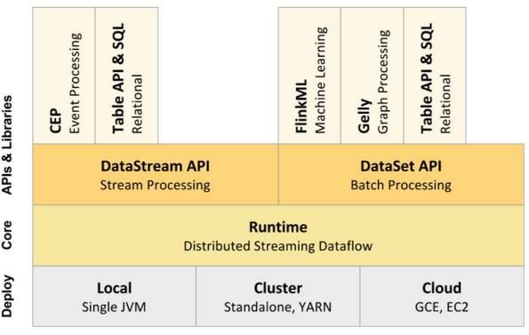
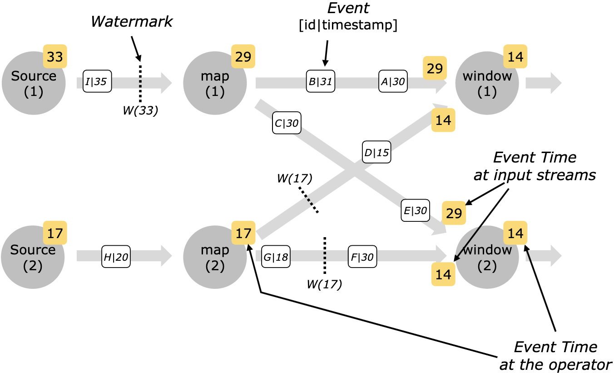

# 1. Flink核心概念和编程模型

## 1.1 flink生态的核心组件栈的分层




## 1.2 flink api的分层

SQL -> High-Level Language

table api  ->  declarative DSL

DataStream/DataSet  ->  core APIs

Stateful Stream Processing  ->  Low-level building block(stream, state, event time)

注意：

（1） 越底层API越灵活，越往上层API越轻便

（2） SQL的必定存在解析，和专称mr的过程，必定有性能损失

（3） SQL构建在table上，相当于是一章虚拟表

（4） 不同类型的table构建在不痛的table环境

（5） table可以和DataStream或DataSet互相转换

（6） streaming sql不同于存储的sql，最终会变成流式执行计划


## 1.3 DataFlow的基本套路


1. 构建安装环境，stream或batch
2. 创建source
3. 对数据transformations
4. 输出结果sink


## 1.4 并行化DataFlow


实际上在设置并行度后，算子会并行运行。


## 1.5 数据的传递

one-to-one：同spark的单依赖

多依赖：

1. 改变流的分区
2.  重新分区策略取决于使用算子

keyby() -> repartition by hash key，根据hash key来发给分区

broadcast -> 给每个机器都发一份

rebalance() -> repartition randomly


## 1.6 windows

1. windows将流分割成小块用于计算。主要分成**Keyed Windows**和**Non-Keyed Windows**

2. windows的生命周期

- 创建：当窗口的第一个元素到达时，创建窗口
- 销毁：当时间（EventTime/ProcessingTime）超过了【窗口最大时间+允许延迟时间】，窗口清除。例如定义5分钟窗口，允许延迟1分钟，那么12:06:01时刻会清除12:00:00-12:06:00的窗口
- 触发器Trigger：设定条件，指定Windows在什么条件下触发。触发器还可以在Windows生命周期内删除窗口内数据（注意不会清除元数据，数据依然可以进入窗口）
- Windows Function：作用于Windows的处理逻辑
- 驱逐器Evictor：相当于Filter，过滤窗口中的数据。分为触发后，在计算前过滤和在计算后过滤。

3. Keyed Windows和Non-Keyed Windows

- 从直观上看，有keyBy是Keyed Windows，没有就是Non-Keyed Windows
- Keyed Windows允许并行执行任务，相同key的元素会被发送到同一个task
- Non-Keyed Windows所有元素会在一个task中，并行度1

4. Windows Assigners

windows Assigners定义了元素如何分配到一个窗口或多个。代码中是window(...)/windowAll()中调用决定WindowAssigner

- count windows

   根据消息的条数来划分的窗口

- Time windows

   `Tumbling window` 翻滚窗口

   

   `Sliding window` 滑动窗口

   

   `Session Window` 

   `Globle window`：所有相同key的element会被分配到同一个globle window，默认trigger是NeverTrigger，所以用户必须自定义触发器，否则不会进行任何计算

   

- 自定义window

5. 触发器 Trigger

- 触发器决定窗口中的数据何时被处理
- 每个windowAssginer都实现了触发器，如果默认触发器不能满足需求可以自定义
- 触发器状态：

```java
/**
	 * No action is taken on the window.
	 * 不操作
	 */
	CONTINUE(false, false),

	/**
	 * {@code FIRE_AND_PURGE} evaluates the window function and emits the window
	 * result.
	 * 触发计算后清除window中数据
	 */
	FIRE_AND_PURGE(true, true),

	/**
	 * On {@code FIRE}, the window is evaluated and results are emitted.
	 * The window is not purged, though, all elements are retained.
	 * 触发窗口计算，但窗口数据不会被清除
	 */
	FIRE(true, false),

	/**
	 * All elements in the window are cleared and the window is discarded,
	 * without evaluating the window function or emitting any elements.
	 * 窗口中所有数据被丢弃并且不会计算
	 */
	PURGE(false, true);
```

- 常用默认触发器

EventTimeTrigger：当EventTIme作为时间时，每个watermarks通过窗口end时间时，EventTimeTrigger就会触发。例如在SlidingEventTimeWindows/TumblingEventTimeWindows中默认都是EventTimeTrigger

```java
@Override
public TriggerResult onElement(Object element, long timestamp, TimeWindow window, TriggerContext ctx) throws Exception {
   if (window.maxTimestamp() <= ctx.getCurrentWatermark()) {
      // if the watermark is already past the window fire immediately
      return TriggerResult.FIRE;
   } else {
      ctx.registerEventTimeTimer(window.maxTimestamp());
      return TriggerResult.CONTINUE;
   }
}
```

NeverTrigger：GlobleWindow的默认trigger，用不触发，所以GlobleWindow必须自定义trigger。

- 自定义Trigger

继承Trigger类，并重写以下方法，代码参考EventTimeTrigger：

```java
public abstract TriggerResult onElement(T element, long timestamp, W window, TriggerContext ctx) throws Exception;

/**
 * Called for every element that gets added to a pane. The result of this will determine
 * whether the pane is evaluated to emit results.
 * 窗口中每来一个元素都会调用
 */
	public abstract TriggerResult onElement(T element, long timestamp, W window, TriggerContext ctx) throws Exception;


/**
 * Called when a processing-time timer that was set using the trigger context fires.
 * 使用processing-time，并且注册的定时器启动
 */
public abstract TriggerResult onProcessingTime(long time, W window, TriggerContext ctx) throws Exception;

/**
 * Called when an event-time timer that was set using the trigger context fires.
 * 使用event-time，并且注册的定时器启动
 */
public abstract TriggerResult onEventTime(long time, W window, TriggerContext ctx) throws Exception;

/**
 * Called when several windows have been merged into one window by the
 * {@link org.apache.flink.streaming.api.windowing.assigners.WindowAssigner}.
 * 合并多个window时
 */
public void onMerge(W window, OnMergeContext ctx) throws Exception {
   throw new UnsupportedOperationException("This trigger does not support merging.");
}

/**
 * Clears any state that the trigger might still hold for the given window. This is called
 * when a window is purged. Timers set using {@link TriggerContext#registerEventTimeTimer(long)}
 * and {@link TriggerContext#registerProcessingTimeTimer(long)} should be deleted here as
 * well as state acquired using {@link TriggerContext#getPartitionedState(StateDescriptor)}.
 */
public abstract void clear(W window, TriggerContext ctx) throws Exception;
```

6. 驱逐器 Evictor

- 驱逐器作用：类似于filter，对窗口中数据过滤，windowAssginer默认没有驱逐器
- 驱逐器可分为窗口触发后，计算前驱逐 和 计算后驱逐

```java
/**
 * Optionally evicts elements. Called before windowing function.
 * 当window计算前，先驱逐元素
 */
void evictBefore(Iterable<TimestampedValue<T>> elements, int size, W window, EvictorContext evictorContext);

/**
 * Optionally evicts elements. Called after windowing function.
 * 在窗口计算后，对结果进行驱逐
 */
void evictAfter(Iterable<TimestampedValue<T>> elements, int size, W window, EvictorContext evictorContext);
```

- 内置驱逐器

countEvictor：窗口中只保留特定数量个元素。

TimeEvictor：使用interval（毫秒数）作为参数，对于一个窗口的所有元素，找出max_timestamp，并驱逐所有max_timestamp-interval的event。

注意：Flink只能保证窗口有序，并不能保证窗口中event有序，所以countEvent不一定保留的是timestamp最大的那一批数据。

## 1.7 Flink的三种Time

1. Event Time 事件时间

- event产生的时间，比如hdfs日志里的时间
- 配合watermark，用于处理乱序数据
- 优势：用于处理乱序数据情况，都能给出正确结果
- 缺点：处理无序数据时，性能会受到影响

2. Ingestion Time 摄取时间

- 日志进入到flink source的时间
- 不需要指定watermark
- 缺点：不能处理乱序和延迟数据

3. Processing Time 处理时间

- 日志被算子处理的时间，即当前主机的时间
- 不需要流和当前机器协调
- 优势：性能最佳，延迟最低
- 缺点：不能处理延迟数据


在代码中设置时间：

```java
final StreamExecutionEnvironment env = StreamExecutionEnvironment.getExecutionEnvironment();

env.setStreamTimeCharacteristic(TimeCharacteristic.ProcessingTime);
// env.setStreamTimeCharacteristic(TimeCharacteristic.IngestionTime);
// env.setStreamTimeCharacteristic(TimeCharacteristic.EventTime);
```

## 1.9 WaterMarks

WaterMarks是Flink衡量EventTime到什么情况的机制，WaterMarks是数据流的一部分，携带了时间戳。Watermark(t))声明EventTime已在该流中达到时间t，这意味着不应再有时间戳t'<= t的event（即时间戳早于或等于WaterMarks的event）。

- WaterMarks在顺序流中的情况：在顺序流中，仅仅是周期性的打上WaterMarks的标签


- WaterMarks在乱序流中的情况：会有EventTime低于水位线的数据被抛弃。例如在下图中stream最新的event时间戳为16，会被抛弃，因为小于W(17)


- 注意：EventTime通常情况下由source创建或从上一个operator中继承。

## 1.10 并行流中的WaterMarks

- WaterMarks通常是source生成，也可以由source后的算子生成，每个subtask会独立生成WaterMarks
- WaterMarks通过operator时，operator会推进EventTime的值，生成新的WaterMarks，同时为下游operator生成新的WaterMarks值。
- 多输入的operator（例如join，union，keyBy）的EventTime是所有输入的EventTime最小值



## 1.11 延迟处理

- 延迟处理机制，允许当EventTime小于WaterMarks时，依旧触发计算，但时间不宜太长。

## 1.12 关于watermarks和allowed lateness的机制总结

默认情况下：当watermark过了窗口最后时间，晚到的元素会被丢弃，但flink允许为窗口设置一个最大的延时。

当数据已经过了watermark的最后时间，但还未到watermark最后时间的延时时间，那么元素仍然可以导致窗口再次触发，例如使用EventTimeTrigger时。

flink watermark和allowed lateness的触发机制

（1）当watermark>=窗口的结束时间 ， 第一次触发

（2）当watermark<窗口的结束时间+allowed lateness的时间，每条数据来都触发，触发时会用窗口中所有数据进行计算

（3）当watermark>=窗口结束时间+allowed lateness的时间，销毁窗口。迟到数据会到**final** OutputTag<String> lateOutputTag = **new** OutputTag<String>(**"late-data"**){}; 

（4）延迟数据在lateOutputTag中，取出后实际是个DataStream，如果不加窗口处理，就和普通流一样，来一条走一条；也可以加窗口处理也和普通流一样

（5）如果window里有多个key，那么会生成多个并行的分片，但触发条件还是watermark>=窗口结束时间和key无关。

例如数据

1487225041000,001

1487225049000,001

1487225053000,001

1487225046000,001

1487225042000,001

1487225057000,001

1487225043000,001

1487225058000,001

1487225049000,001

会形成以下触发形式：

假定窗口为滚动窗口，并设置watermark 3s, lateness 5s, window 10s, PeriodicWatermarks

| event_time    | Event_time时间 | Watermarks    | watermarks时间 | [window_start | Window_end) | 触发                  |
| ------------- | -------------- | ------------- | -------------- | ------------- | ----------- | --------------------- |
| 1487225041000 | 14:04:01       | 1487225038000 | 14:03:58       | 14:04:00      | 14:04:10    | 不触发                |
| 1487225049000 | 14:04:09       | 1487225046000 | 14:04:06       | 14:04:00      | 14:04:10    | 不触发                |
| 1487225053000 | 14:04:13       | 1487225050000 | 14:04:10       | 14:04:10      | 14:04:20    | 第一次触发[00:10)窗口 |
| 1487225046000 | 14:04:06       | 1487225050000 | 14:04:10       | 14:04:00      | 14:04:10    | 延迟计算触发[00:10)   |
| 1487225042000 | 14:04:02       | 1487225050000 | 14:04:10       | 14:04:00      | 14:04:10    | 延迟计算触发[00:10)   |
| 1487225057000 | 14:04:17       | 1487225054000 | 14:04:14       | 14:04:10      | 14:04:20    | 不触发                |
| 1487225043000 | 14:04:03       | 1487225054000 | 14:04:14       | 14:04:00      | 14:04:10    | 延迟计算触发[00:10)   |
| 1487225058000 | 14:04:18       | 148722505500  | 14:04:15       | 14:04:10      | 14:04:20    | 丢弃窗口[00:10)       |
| 1487225049000 | 14:04:09       | 148722505500  | 14:04:15       | 14:04:00      | 14:04:10    | 放入late队列          |

根据以上结果，结论如下：

1. event是根据自身EventTime分配窗口
2. PeriodicWatermarks watermarks总是递增，不会因为延迟数据来了，watermark减小
3. 窗口第一次触发是watermarks=window_endTime
4. 窗口延迟触发是watermarks在[window_endTime,window_endTime+lateness]
5. 窗口数据被清除是watermarks>=window_endTime+lateness
6. 因为watermarks=EventTime-watermark，所以窗口会在EventTime=window_endTime+lateness+watermark时被删除

## 1.13 Stateful Operations

1. 状态

state一般指具体的task/operator的状态

2. Operator state

某个operator处理到数据的状态，每个并发都有自己的状态

3. Keyed state

基于KeyedStream上的状态。这个状态和key绑定，对keyedstream每个key都有一个state

4. 原始状态和托管状态

待后面补充

5. state backend

The exact data structures in which the key/values indexes are stored depends on the chosen [state backend](https://ci.apache.org/projects/flink/flink-docs-release-1.10/ops/state/state_backends.html). One state backend stores data in an in-memory hash map, another state backend uses [RocksDB](http://rocksdb.org/) as the key/value store. In addition to defining the data structure that holds the state, the state backends also implement the logic to take a point-in-time snapshot of the key/value state and store that snapshot as part of a checkpoint.


## 1.14 Checkpoint

1. checkpoint

在某个时刻，将所有task的状态做快照，存储到state backend

2. 轻量级容错
3. 保证exactly-once
4. 用于内部失败的恢复
5. 基本原理

-  source注入barrier

- barrier作为checkpoint的标志

6. 无需人工干预


## 1.15 Savepoint

1. 功能和checkpoint相同，用于存储某个时刻task的状态
2. 两种触发方式

- Cancel with savepoint

- 手动出发

3. savepoint是特殊的checkpoint，不会过期，不会覆盖，除非手动删除。


# 2. Flink运行时架构

- client
- The **JobManagers** (also called *masters*)功能是协调分布式的执行。调度task, 协调 checkpoints, 协调错误时恢复等。

There is always at least one Job Manager. A high-availability setup will have multiple JobManagers, one of which one is always the *leader*, and the others are *standby*.

- The **TaskManagers** (also called *workers*) 功能是执行dataflow的task (或具体点是执行子任务)，并且缓存和交换数据

There must always be at least one TaskManager.

- JobManager和TaskManager可以多种方式运行，比如standalone，YARN，Mesos等
- 角色通信：Akka
- 数据传输：Netty

## 2.1 flink standalone运行时架构


## 2.2 flink yarn运行时架构


1. client确认RS是否有足够资源（启动ApplicationMaster的memory和vcores），资源充足时将jar包和配置上传到HDFS
2. client请求RS分配一个container用于启动ApplicationMaster
3. 当client将AM的配置和jar文件当作资源向RS注册之后，RS会分配一个container并指定一个NM启动AM。Flink JobManager和AM运行在相同container
4. 当JobManager启动完成后，AM就知晓JM的地址（他自己）。AM会生成Flink TaskManager的配置，并上传到HDFS
5. AM开始分配Flink TaskManager的container，TaskManager会去HDFS上下载jar包和修改后的配置，当TM启动完成后Flink开始接收Jobs

## 2.3 TaskManager slot && 共享 slot


- 每个worker（TaskManager）都是一个JVM进程，每个task slot是一个线程，task slot运行在JM中，task slot决定了worker接受多少task。

- 每个task slot都是TaskManager资源的固定子集。例如一个TaskManager有6G内存，包含3个task slot，那么每个task slot有2G内存。目前cpu没做资源隔离，只有内存隔离。

- 同一个TaskManager（同一个JVM）中运行的task共享TCP链接、心跳、数据集和数据结构，可以减少任务开销


默认情况下，flink允许同一个job的subtask共享slot，好处如下：

- flink集群的最大并行度等于slot数（前提是都在同一个slot sharing group）
- 如果不共享slot，资源费密集型操作如map会使用和资源密集型操作window()一样多的资源，但实际上map并不需要那么多资源。如图通过共享slot，我们将并行度从2提升到6来充分利用slot，同时确保资源开销大的subtask可以公平分布在TaskManager中。

## 2.4 Operator Chain && Task

为了高效执行任务，flink尽可能把operator的subtask chain在一起形成新的task


1. Operator Chain的优点：

- 减少线程的切换（cpu是分时段的，多线程轮流运行，所以有切换）
- 减少缓冲区的开销
- 提高整体吞吐量并且减少延迟
- 减小序列化和反序列化（写到缓冲区和从缓冲区取需要序列化和反序列化）

2. Operator Chain的组成条件（缺一不可）

- 算子没有禁用Chain
- 上下游operator并行度一致
- 下游算子入度是1
- 上下游算子在同一个slot group（会通过slot group控制分配到同一个slot）
- 下游节点的chain策略为ALWAYS
- 上游节点chain的策略为ALWAYS或HEAD（表示可以和下游连）
- 上下游算子之间不是shuffle

## 2.5 编程改变OperatorChain的行为

- 在DataStream的opeartor后调用startNewChain()，表示这个operator开始是新的chain

- disableChaining()来指定算子不参与chain

  ```java
  source.flatMap(new CountWithOperatorListState()).disableChaining()
  ```

- 通过改变slot group来改变chain行为

  ```java
  source.flatMap(new CountWithOperatorListState()).disableChaining()
  ```

- 调整并行度

## 2.6 SlotSharingGroup（soft）&& CoLocationGroup(hard)

1. slotSharingGroup（软限制）

- 在不同slot group的task不会共享同一个slot

- 保证同一个group的并行度相同的sub-tasks共享同一个slot

- 算子默认的group是default

- 为了防止不合理共享slot，用户可以通过slotSharingGroup("name")强制指定共享组，从而改变共享slot行为

  ```java
  source.flatMap(new CountWithOperatorListState()).slotSharingGroup("group1")
  ```

- 下游算子group怎么确定？如果自身没有设置group，那就和上游算子相同
- 可以适当减少每个slot运行的线程数量，从而整体上减小机器负载

2. CoLocationGroup（强制）

- 保证所有并行度相同的sub-task运行在同一个slot
- 主要用于迭代流（flink ml）

## 2.7 slot和parallelism的关系

1. 如果所有operator处于同一个slot group，所需的task slots数量和task最高并行度相同

2. 如果operator有多个slot group，所需的slot是各个group最大并行度之和。下图任务需要slot为10+20=30

   


# 3. Flink 编程

## 3.1 DataSet和DataStream

- 表示flink分布式数据集

- 包含重复的、不可变数据集

- DataSet有界，DataSteam可以无界

- 可以从数据源、各类算子操作创建

## 3.2 指定key

例如 join,coGroup, keyBy, groupBy, Reduce, GroupReduce,Windows都需要指定key

1. Tuple定义key

```java
DataStreamSource<Tuple3<String, Integer, Integer>> source = env.fromElements(
        new Tuple3<String, Integer, Integer>("a", 1, 2),
        new Tuple3<String, Integer, Integer>("b", 2, 3)
);

// 元组第一个元素为key
source.keyBy(0);
// 元组第一和二个元素为key
source.keyBy(0, 1);
```

2. Java实例key选择

举例有两个类：

```java
class Person {
    public Person(String name, int age, Address address){
        this.name = name;
        this.address = address;
        this.age = age;
    }
    String name;
    int age;
    Address address;

}

class Address {
    public Address(String city, String street, Tuple2<String, Integer> home) {
        this.city = city;
        this.street = street;
        this.home = home;
    }
    String city;
    String street;
    Tuple2<String, Integer> home;
}
```

在选取属性时：

```
// 以name为key
personInfoDS.keyBy("name");
// 以Person中Address的city为key
personInfoDS.keyBy("address.city");
// 以Person中Address的home的第一个元素为key
personInfoDS.keyBy("address.home._0");
// 用keySelector选择key
personInfoDS.keyBy(new KeySelector<Person, String>() {
    @Override
    public String getKey(Person person) throws Exception {
        return person.address.city + "_" + person.age;
    }
});
```

## 3.3 计数器和累加器

- 计数器

```java
DataStreamSource<String> source = env.fromElements("a", "b", "a", "c");

DataStream<Tuple2<String, Integer>> wordCount =
        source.map(new RichMapFunction<String, Tuple2<String, Integer>>() {
						// 在Rich方法中可用，自定义累加器
            IntCounter lineCounter = new IntCounter();

            @Override
            public void open(Configuration parameters) throws Exception {
                super.open(parameters);
                // open方法中注册累加器
                getRuntimeContext().addAccumulator("line_counter", lineCounter);
            }

            @Override
            public Tuple2<String, Integer> map(String value) throws Exception {
                // 在要计数的地方累加
                lineCounter.add(1);
                return new Tuple2<>(value, 1);
            }
        });

// execute会将累加器的结果保存在JobExecutionResult
JobExecutionResult executionResult = env.execute("counter");
// 获取累加器
Integer counter = executionResult.getAccumulatorResult("line_counter");
System.out.println(counter);
```

- 累加器

自定义累加器

待补充

## 3.4 DataStream APIs

### 3.4.1 Flink的四层执行计划


### 3.4.2 Flink生成的Graph

1. StreamGraph

- 根据代码生成的graph，表示所有operator的拓扑结构
- 在client端生成
- 在StreamExecutionEnvironment.execute()中调用，将所有算子存储在List<StreamTransformation<?>> transformations中。transformations描述DataStream之间的转换关系和StreamNode和StreamEdge等信息

2. JobGraph

- 优化streamGraph
- 将operator chain在一起
- 在client端生成
- StreamNode变成JobVertex，StreamEdge变成JobEdge；配置checkpoint策略；配置重启策略；根据group指定JobVertex所属的SlotSharingGroup

3. ExecutionGraph

- 对JobGraph进行并行化
- 在JobManager端生成
- JobVertxt变成ExecutionJobVertex，JobEdge变成ExecutionEdge;ExecutionJobVertex并发任务；JobGraph是二维结构，根据二位结构分发对应Vertext到指定slot

4. 物理执行计划

- 实际执行图，不可见


### 3.4.3 Source

Source是flink的数据源，有内置数据源也支持用户自定义

1. 基于文件

- readTextFile(path)
- readFile(fileInputFormat, path)
- readFile(fileInputFormat, path, watchType, interval, pathFilter, typeInfo)

2. 基于socket

- socketTextStream

3. 基于Collection

- fromCollection(Collection)
- fromCollection(Iterator, Class)：Class是Iterator中数据类型
- fromElements(T ...)
- fromParallelCollection(SplittableIterator, Class)
- generateSequence(from, to)

4. 用户自定义

- ​	继承SourceFunction
- 继承RichSourceFunction
- 继承ParellelSourceFunction
- addSource(new CustomSource)调用

代码示例：自定义Mysql数据源，继承RichSourceFunction

```java
public class MysqlSource extends RichSourceFunction<HashMap<String, Tuple2<String, Integer>>> {

    private String jdbcUrl = "jdbc:mysql://127.0.0.1:3306/test";
    private String user = "root";
    private String passwd = "root";
    private Integer secondInterval = 5;

    private Connection conn = null;
    private PreparedStatement pst1 = null;
    private PreparedStatement pst2 = null;

    private boolean isRunning = true;
    private boolean isFirstTime = true;

    public MysqlSource(){}

    public MysqlSource(String jdbcUrl, String user, String passwd,Integer secondInterval) {
        this.jdbcUrl = jdbcUrl;
        this.user = user;
        this.passwd = passwd;
        this.secondInterval = secondInterval;
    }

    @Override
    public void open(Configuration parameters) throws Exception {
        super.open(parameters);
        Class.forName("com.mysql.jdbc.Driver");
        conn = DriverManager.getConnection(jdbcUrl, user, passwd);

    }

  /**
    * 当my_status中up_status更新后，才查询account的数据并发送
    **/
    @Override
    public void run(SourceContext<HashMap<String, Tuple2<String, Integer>>> out) throws Exception {
        String staticStatusSql = "SELECT up_status FROM my_status";
        String sql = "SELECT id,name,age FROM account";

        pst1 = conn.prepareStatement(staticStatusSql);
        pst2 = conn.prepareStatement(sql);

        HashMap<String, Tuple2<String, Integer>> mysqlData = new HashMap();

        while (isRunning){

            ResultSet rs1 = pst1.executeQuery();
            Boolean isUpdateStatus = false;
            while(rs1.next()){
                isUpdateStatus = (rs1.getInt("up_status") == 1);
            }
            System.out.println();
            System.out.println("isUpdateStatus:  " + isUpdateStatus + " isFirstTime: " + isFirstTime);

            if(isUpdateStatus || isFirstTime){
                ResultSet rs2 = pst2.executeQuery();
                while(rs2.next()){
                    int id = rs2.getInt("id");
                    String name = rs2.getString("name");
                    int age = rs2.getInt("age");
                    mysqlData.put(id + "", new Tuple2<String, Integer>(name, age));
                }
                isFirstTime = false;
                System.out.println("我查了一次mysql，数据是： " + mysqlData);
                out.collect(mysqlData);
            }else{
                System.out.println("这次没查mysql");
            }

            Thread.sleep(secondInterval * 1000);
        }
    }

    @Override
    public void cancel() {

        isRunning = false;
    }

    @Override
    public void close() throws Exception {
        super.close();
        if(conn != null){
            conn.close();
        }
        if(pst1 != null){
            pst1.close();
        }
        if(pst2 != null){
            pst2.close();
        }
    }
}
```

它处调用：

```java
env.addSource(new MysqlSource())
```

### 3.4.4 Sink

- 继承SinkFunction
- 继承RichSinkFunction
- 从addSink(new CustomSink)调用

代码示例，自定义mysql sink，继承RichSinkFunction

```java
public class MysqlSink extends RichSinkFunction<Tuple3<Integer, String, Integer>> {

    private String jdbcUrl = "jdbc:mysql://127.0.0.1:3306/test";
    private String user = "root";
    private String passwd = "root";

    private Connection conn = null;
    private PreparedStatement pst = null;
    private PreparedStatement pstIst = null;

    public MysqlSink(){}

    public MysqlSink(String jdbcUrl, String user, String passwd) {
        this.jdbcUrl = jdbcUrl;
        this.user = user;
        this.passwd = passwd;
    }

    @Override
    public void open(Configuration parameters) throws Exception {
        super.open(parameters);
        Class.forName("com.mysql.jdbc.Driver");
        conn = DriverManager.getConnection(this.jdbcUrl, this.user, this.passwd);
    }

    @Override
    public void invoke(Tuple3<Integer, String, Integer> student, Context context) throws Exception {
        String creatTableSQL = "CREATE TABLE IF NOT EXISTS test.mysql_sink_test" +
                "(" +
                "id INT," +
                "stu_name VARCHAR(25)," +
                "age INT" +
                ")";

        String insertSQL =
                "INSERT INTO test.mysql_sink_test(id,stu_name,age) VALUES(?,?,?)";

        // 如果表不存在，建表
        pst = conn.prepareStatement(creatTableSQL);
        pst.execute();

        // 插入语句
        pstIst = conn.prepareStatement(insertSQL);
        pstIst.setInt(1, student.f0);
        pstIst.setString(2, student.f1);
        pstIst.setInt(3, student.f2);
        int result = pstIst.executeUpdate();
        System.out.println(result);
    }

    @Override
    public void close() throws Exception {
        super.close();
        pst.close();
        pstIst.close();
        conn.close();
    }
}
```

调用方法：

```java
source.addSink(new MysqlSink());
```

- 收集sink的数据

```java
// 方法1:print
lessThanZero.print();

// 方法2:DataStreamUtils.collect方法
Iterator<Long> results = DataStreamUtils.collect(lessThanZero);
while(results.hasNext()){
  System.out.println(results.next());
}
```

### 3.4.5 Operator

Please see [operators](https://ci.apache.org/projects/flink/flink-docs-release-1.10/dev/stream/operators/index.html) for an overview of the available stream transformations.

/flink资料整理/image-20200703105155347.png)

| Transformation                                               | Description                                                  |
| :----------------------------------------------------------- | :----------------------------------------------------------- |
| **Map** <br />DataStream → DataStream                        | 一进一出                                                     |
| **FlatMap**<br />DataStream → DataStream                     | Takes one element and produces zero, one, or more elements. A flatmap function that splits sentences to words |
| **Filter** <br />DataStream → DataStream                     | 过滤操作                                                     |
| **KeyBy** <br />DataStream→KeyedStream                       | 根据key将不同的日志分配到不同的partition中，内部是根据hash分配key<br />注意：要使用keyBy必须：<br />1. POJO类重写`hashCode()`<br />2. 不能是array<br /><br />`source.keyBy(0);` |
| **Reduce** <br />KeyedStream→DataStream                      | 滚动计算，每次传入的是当前元素和上一个元素<br />keyedStream.reduce(new ReduceFunction<Integer>() {     <br />  @Override     <br />  public Integer reduce(Integer value1, Integer value2)   throws Exception {         <br />    return value1 + value2;     <br />  } }); |
| **Fold** <br />KeyedStream→DataStream                        | 滚动计算，每次传入的是当前元素和上一个元素.  <br />例如sequence (1,2,3,4,5), 输出 "start-1", "start-1-2", "start-1-2-3", ...<br />DataStream<String> result =   <br />keyedStream.fold("start", new FoldFunction<Integer, String>() {     <br />  @Override     <br />  public String fold(String current, Integer value) {        <br />     return current + "-" + value;     <br />  }   }); |
| **Aggregations** KeyedStream→DataStream                      | keyedstream的一些滚动计算函数。 min和minBy的区别是，min只返回最小值，minBy返回最小值那一整条记录.<br />keyedStream.sum(0); <br />keyedStream.sum("key"); <br />\|keyedStream.min(0); <br />\|keyedStream.min("key"); <br />keyedStream.max(0); <br />keyedStream.max("key"); <br />keyedStream.minBy(0); <br />keyedStream.minBy("key"); <br />keyedStream.maxBy(0); <br />keyedStream.maxBy("key"); |
| **Window** <br />KeyedStream→WindowedStream                  | 窗口函数，Windows对KeyedStreams起作用。 dataStream.keyBy(0).window(TumblingEventTimeWindows.of(Time.seconds(5))); // Last 5 seconds of data    ` |
| **WindowAll** <br />DataStream→AllWindowedStream             | 窗口函数，作用同window。windowAll会把所有的event放到一个task中。<br />`dataStream.windowAll(TumblingEventTimeWindows.of(Time.seconds(5)));   ` |
| **Window Apply** <br />WindowedStream → DataStream AllWindowedStream→DataStream | apply方法给window函数添加用户自定义的逻辑，如果是WindowAll，则需实现AllWindowFunction。<br /> |
| **Window Process** <br />WindowedStream → DataStream AllWindowedStream→DataStream | 用apply的地方都可以用process，process方法在参数中多了context的信息。<br /> |
| **Window Reduce** WindowedStream → DataStream                | 将reduce函数作用于窗口，返回一个reduce的值。<br /> |
| **Window Fold**<br />WindowedStream → DataStream             | 将fold函数作用于window    `                                  |
| **Aggregations on windows** WindowedStream → DataStream      | 作用于窗口函数的函数，min和minBy的区别是，min只返回最小值，minBy返回最小值那一整条记录<br />`windowedStream.sum(0);`<br />`windowedStream.sum("key")`;<br />`windowedStream.min(0);`<br />`windowedStream.min("key");`<br />` windowedStream.max(0);<br />`<br />`windowedStream.max("key");<br />`<br />`windowedStream.minBy(0);` <br />`windowedStream.minBy("key"); `<br />`windowedStream.maxBy(0); `<br />`windowedStream.maxBy("key");    ` |
| **Union** <br />DataStream* → DataStream                     | 把两个或更多DataStream的数据union到一起，如果union自己，数据会重复。<br />`dataStream.union(otherStream1, otherStream2, ...);    ` |
| **Window Join** DataStream,DataStream → DataStream           | 根据指定的key，将两个datastream在指定的窗口中进行join操作。<br /> |
| **Interval Join** KeyedStream,KeyedStream → DataStream       | 在指定的时间条件内，将两个keyedStream e1（left）和e2（right）用key进行join，条件e1.timestamp + lowerBound <= e2.timestamp <= e1.timestamp + upperBound && key1 == key2<br />// this will join the two streams so that // key1 == key2 && leftTs - 2 < rightTs < leftTs + 2  //upperBoundExclusive()代表是否包含上界 |
| **Window CoGroup** DataStream,DataStream → DataStream        | window的cogroupwindow. |
| **Connect** <br />DataStream,DataStream→ ConnectedStreams    | “Connect”两个保留其类型的DataStream，两个DataStream类型可以不同。 连接允许两个流之间共享状态，实际上是一种join。<br />`DataStream<Integer> someStream = //... `<br />`DataStream<String> otherStream = //... `<br />`ConnectedStreams<Integer,String>connectedStreams=someStream .connect(otherStream);    ` |
| **CoMap, CoFlatMap** ConnectedStreams → DataStream           | connected data stream的map和flatMap |
| **Split**<br /> DataStream → SplitStream SplitStream即将弃用 | 将一个DataStream根据规则分到多个流中。<br />注意：放到output中的元素是value%2和else里的数，不是even和odd。even和odd只是之后取到那一批数据的名称 |
| **Select** <br />SplitStream → DataStream                    | 从splitedStream中获取一批数据. |
| **Iterate** <br />DataStream → IterativeStream → DataStream  | 流迭代运算，见3.4.5                                          |
| **Extract Timestamps** <br />DataStream → DataStream         | Extracts timestamps from records in order to work with windows that use event time semantics. See [Event Time](https://ci.apache.org/projects/flink/flink-docs-release-1.10/dev/event_time.html).`stream.assignTimestamps (new TimeStampExtractor() {...});                ` |

Flink在延迟和吞吐量之间的把控：

默认情况下，数据会先缓存到缓存区，当大小达到阈值后发送，来增大吞吐量，但这种方式演唱了延迟。Flink提供了setBufferTimeout来控制延迟，当缓冲区大小和延迟时间达成一个条件，即发送数据。

```
env.setBufferTimeout(100);
DataStreamSource<Integer> source = env.fromElements(1, 2, 3, 4, 5, 6, 7);
source.map(new MapFunction<Integer, Integer>() {
    ...
}).setBufferTimeout(100);
```

### 3.4.5 流迭代运算

1. 创建迭代头IterativeStream
2. 定义迭代计算（map，filter等）
3. 定义关闭迭代逻辑closeWith
4. 可以定义终止迭代逻辑

```java
DataStream<Long> source = env.generateSequence(-5, 100);

IterativeStream<Long> iterate = source.iterate();
DataStream<Long> minuOne = iterate.map(new MapFunction<Long, Long>() {
    @Override
    public Long map(Long value) throws Exception {
        return (value - 1);
    }
});
DataStream<Long> stillGreaterZero = minuOne.filter(new FilterFunction<Long>() {
    @Override
    public boolean filter(Long value) throws Exception {
        return (value > 0);
    }
});
iterate.closeWith(stillGreaterZero);

stillGreaterZero.print();

env.execute("test Iterator");
```

### 3.4.6 Window

1. 所有流的编程套路

- Keyed Windows

```
stream
       .keyBy(...)               <-  keyed versus non-keyed windows
       .window(...)              <-  required: "assigner"
      [.trigger(...)]            <-  optional: "trigger" (else default trigger)
      [.evictor(...)]            <-  optional: "evictor" (else no evictor)
      [.allowedLateness(...)]    <-  optional: "lateness" (else zero)
      [.sideOutputLateData(...)] <-  optional: "output tag" (else no side output for late data)
       .reduce/aggregate/fold/apply()      <-  required: "function"
      [.getSideOutput(...)]      <-  optional: "output tag"
```

- Non-Keyed Windows

```
stream
       .windowAll(...)           <-  required: "assigner"
      [.trigger(...)]            <-  optional: "trigger" (else default trigger)
      [.evictor(...)]            <-  optional: "evictor" (else no evictor)
      [.allowedLateness(...)]    <-  optional: "lateness" (else zero)
      [.sideOutputLateData(...)] <-  optional: "output tag" (else no side output for late data)
       .reduce/aggregate/fold/apply()      <-  required: "function"
      [.getSideOutput(...)]      <-  optional: "output tag"
```


1. Tumbling Windows

```java
DataStream<T> input = ...;

// tumbling event-time windows
input
    .keyBy(<key selector>)
    .window(TumblingEventTimeWindows.of(Time.seconds(5)))
    .<windowed transformation>(<window function>);

// daily tumbling event-time windows offset by -8 hours.
input
    .keyBy(<key selector>)
    .window(TumblingEventTimeWindows.of(Time.days(1), Time.hours(-8)))
    .<windowed transformation>(<window function>);
```

2. Sliding Windows

```java
DataStream<T> input = ...;

// sliding event-time windows
input
    .keyBy(<key selector>)
    .window(SlidingEventTimeWindows.of(Time.seconds(10), Time.seconds(5)))
    .<windowed transformation>(<window function>);

// sliding processing-time windows
input
    .keyBy(<key selector>)
    .window(SlidingProcessingTimeWindows.of(Time.seconds(10), Time.seconds(5)))
    .<windowed transformation>(<window function>);

// sliding processing-time windows offset by -8 hours
input
    .keyBy(<key selector>)
    .window(SlidingProcessingTimeWindows.of(Time.hours(12), Time.hours(1), Time.hours(-8)))
    .<windowed transformation>(<window function>);
```

3. Globle Windows

```java
ataStream<T> input = ...;

input
    .keyBy(<key selector>)
    .window(GlobalWindows.create())
    .trigger(Customer Trigger)
    .<windowed transformation>(<window function>);
```

4. Windows Function

- ReduceFunction：

```java
@Test
public void testReduceFunction() throws Exception {
    env.setStreamTimeCharacteristic(TimeCharacteristic.EventTime);

    DataStreamSource<Tuple4<Long, String, String, Double>> source =
        env.fromElements(
        new Tuple4<Long, String, String, Double>(System.currentTimeMillis(), "张三", "class1", 100.0),
        new Tuple4<Long, String, String, Double>(System.currentTimeMillis(), "王五", "class1", 90.0),
        new Tuple4<Long, String, String, Double>(System.currentTimeMillis(), "赵六", "class1", 60.0),
        new Tuple4<Long, String, String, Double>(System.currentTimeMillis(), "李四", "class2", 96.0),
        new Tuple4<Long, String, String, Double>(System.currentTimeMillis()+10000, "王八", "class1", 71.0)
        );

    DataStream<Tuple2<String, Double>> classScore = source.assignTimestampsAndWatermarks(new wmarkAss())
        .keyBy(new KeySelector<Tuple4<Long, String, String, Double>, String>() {
            @Override
            public String getKey(Tuple4<Long, String, String, Double> value) throws Exception {
                return value.f2;
            }
        }).window(TumblingEventTimeWindows.of(Time.seconds(5)))
        .reduce(new ReduceFunction<Tuple4<Long, String, String, Double>>() {
            @Override
            public Tuple4<Long, String, String, Double> reduce(Tuple4<Long, String, String, Double> first, Tuple4<Long, String, String, Double> second) throws Exception {
                return new Tuple4<Long, String, String, Double>(0L, "", second.f2, first.f3 + second.f3);
            }
        })
        .map(new MapFunction<Tuple4<Long, String, String, Double>, Tuple2<String, Double>>() {

            @Override
            public Tuple2<String, Double> map(Tuple4<Long, String, String, Double> value) throws Exception {
                return new Tuple2<String, Double>(value.f2, value.f3) ;
            }
        });

    classScore.print();

    env.execute("class avg");
}
```

-  AggregateFunction：求各班级平均分

```java
@Test
public void windowAggregateFunction() throws Exception {

  env.setStreamTimeCharacteristic(TimeCharacteristic.EventTime);

  System.out.println(System.currentTimeMillis());
  DataStreamSource<Tuple4<Long, String, String, Double>> source =
    env.fromElements(
    new Tuple4<Long, String, String, Double>(System.currentTimeMillis(), "张三", "class1", 100.0),
    new Tuple4<Long, String, String, Double>(System.currentTimeMillis(), "李四", "class2", 96.0),
    new Tuple4<Long, String, String, Double>(System.currentTimeMillis(), "王五", "class1", 90.0),
    new Tuple4<Long, String, String, Double>(System.currentTimeMillis(), "赵六", "class1", 60.0),
    new Tuple4<Long, String, String, Double>(System.currentTimeMillis()+10000, "王八", "class1", 71.0)
  );

  DataStream<Double> classAvgScore =
    source
    .assignTimestampsAndWatermarks(new wmAssigner())
    .keyBy(2)
    .window(TumblingEventTimeWindows.of(Time.seconds(1)))
    .aggregate(new AggregateFunction<Tuple4<Long, String, String, Double>, Tuple2<Double, Double>, Double>() {
      @Override
      public Tuple2<Double, Double> createAccumulator() {
        return new Tuple2<Double, Double>(0.0, 0.0);
      }

      @Override
      public Tuple2<Double, Double> add(Tuple4<Long, String, String, Double> value, Tuple2<Double, Double> accumulator) {
        return new Tuple2<Double, Double>(accumulator.f0 + value.f3, accumulator.f1 + 1);
      }

      @Override
      public Double getResult(Tuple2<Double, Double> accumulator) {
        return accumulator.f0 / accumulator.f1;
      }

      @Override
      public Tuple2<Double, Double> merge(Tuple2<Double, Double> a, Tuple2<Double, Double> b) {
        return new Tuple2<Double, Double>(a.f0 + b.f0, a.f1 + b.f1);
      }
    });

  classAvgScore.print();

  env.execute("class avg");
}

class wmAssigner implements AssignerWithPeriodicWatermarks<Tuple4<Long, String, String, Double>> {


    private final long maxOutOfOrderness = 3000; // 10 seconds

    private long currentMaxTimestamp;

    @Nullable
    @Override
    public Watermark getCurrentWatermark() {
        return new Watermark(currentMaxTimestamp - maxOutOfOrderness);
    }

    @Override
    public long extractTimestamp(Tuple4<Long, String, String, Double> element, long previousElementTimestamp) {
        long eventTime = element.f0;
        currentMaxTimestamp = Math.max(element.f0, currentMaxTimestamp);
        return eventTime;
    }
}
```

5. ProcessWindowFunction

```java
@Test
public void testProcessWindowFunction() throws Exception {
    env.setStreamTimeCharacteristic(TimeCharacteristic.EventTime);

    DataStreamSource<Tuple4<Long, String, String, Double>> source =
            env.fromElements(
      new Tuple4<Long, String, String, Double>(System.currentTimeMillis(), "张三", "class1", 100.0),
      new Tuple4<Long, String, String, Double>(System.currentTimeMillis(), "李四", "class2", 96.0),
      new Tuple4<Long, String, String, Double>(System.currentTimeMillis(), "王五", "class1", 90.0),
      new Tuple4<Long, String, String, Double>(System.currentTimeMillis(), "赵六", "class1", 60.0),
      new Tuple4<Long, String, String, Double>(System.currentTimeMillis()+10000, "王八", "class1", 71.0)
            );

    DataStream<Tuple3<String, Double, String>> classAvg = source.assignTimestampsAndWatermarks(new wmarkAss())
        .keyBy(new KeySelector<Tuple4<Long, String, String, Double>, String>() {
            @Override
            public String getKey(Tuple4<Long, String, String, Double> value) throws Exception {
                return value.f2;
            }
        })
        .window(TumblingEventTimeWindows.of(Time.seconds(5)))
        .process(new ProcessWindowFunction<Tuple4<Long, String, String, Double>, Tuple3<String, Double, String>, String, TimeWindow>() {
            @Override
            public void process(String key, Context context, Iterable<Tuple4<Long, String, String, Double>> elements, Collector<Tuple3<String, Double, String>> out) throws Exception {
                Double totalScore = 0.0;
                Integer studentNum = 0;
                Iterator<Tuple4<Long, String, String, Double>> stuInfos = elements.iterator();
                while (stuInfos.hasNext()) {
                    Tuple4<Long, String, String, Double> stuInfo = stuInfos.next();
                    totalScore += stuInfo.f3;
                    studentNum += 1;
                }

                String windowInfo = context.window().getStart() + "_" + context.window().getEnd();
                out.collect(new Tuple3<String, Double, String>(key, totalScore / studentNum, windowInfo));
            }
        });

    classAvg.print();

    env.execute("class avg");
}
```

6. ProcessWindowFunction和ReduceFunction/AggregateFunction混合使用

混合使用的意义：ProcessWindowFunction会将整个窗口所有的数据汇总到一起统一计算；在混合使用时，所有的数据现在ReduceFunction/AggregateFunction先计算一次，再将结果给ProcessWindowFunction。这样的优点在于ReduceFunction/AggregateFunction属于滚动计算，效率比全量数据汇总计算要高得多，再将汇总后的小数据给ProcessWindowFunction，很大程度减小了计算量，提高性能。

```java
@Test
public void testProcessFuncCombieAggFunc() throws Exception {

    env.setStreamTimeCharacteristic(TimeCharacteristic.EventTime);

    DataStreamSource<Tuple4<Long, String, String, Double>> source =
        env.fromElements(
        new Tuple4<Long, String, String, Double>(System.currentTimeMillis(), "张三", "class1", 100.0),
        new Tuple4<Long, String, String, Double>(System.currentTimeMillis(), "王五", "class1", 90.0),
        new Tuple4<Long, String, String, Double>(System.currentTimeMillis(), "赵六", "class1", 60.0),
        new Tuple4<Long, String, String, Double>(System.currentTimeMillis(), "李四", "class2", 96.0),
        new Tuple4<Long, String, String, Double>(System.currentTimeMillis(), "李四", "class2", 99.0),
        new Tuple4<Long, String, String, Double>(System.currentTimeMillis()+10000, "王八", "class1", 71.0)
        );

    DataStream<Tuple2<String, Double>> avgScore = source.assignTimestampsAndWatermarks(new wmarkAss())
        .keyBy(new KeySelector<Tuple4<Long, String, String, Double>, String>() {
            @Override
            public String getKey(Tuple4<Long, String, String, Double> value) throws Exception {
                return value.f2;
            }
        })
        .window(TumblingEventTimeWindows.of(Time.seconds(6)))
        .aggregate(new MyAggFunction(), new MyProcessWindowFunction());

    avgScore.print();

    env.execute("test combie");

}

class MyAggFunction implements AggregateFunction<Tuple4<Long,String,String,Double>, Tuple2<Double, Double>, Double>{

    @Override
    public Tuple2<Double, Double> createAccumulator() {
        return new Tuple2<>(0.0, 0.0);
    }

    @Override
    public Tuple2<Double, Double> add(Tuple4<Long, String, String, Double> value, Tuple2<Double, Double> accumulator) {
        return new Tuple2<>(accumulator.f0 + value.f3, accumulator.f1 + 1);
    }

    @Override
    public Double getResult(Tuple2<Double, Double> accumulator) {
        return accumulator.f0 / accumulator.f1;
    }

    @Override
    public Tuple2<Double, Double> merge(Tuple2<Double, Double> a, Tuple2<Double, Double> b) {
        return new Tuple2<Double, Double>(a.f0 + b.f0, a.f1 + b.f1);
    }
}

class MyProcessWindowFunction extends ProcessWindowFunction<Double, Tuple2<String, Double>, String, TimeWindow> {

    @Override
    public void process(String key, Context context, Iterable<Double> elements, Collector<Tuple2<String, Double>> out) throws Exception {
        Iterator<Double> classAvg = elements.iterator();
        Double maxScore = 0.0;
        while(classAvg.hasNext()){
            maxScore = Math.max(classAvg.next(), maxScore);
        }
        out.collect(new Tuple2<>(key, maxScore));
    }
}
```

7. 各种window算法的比较

| Function                                       | 优点 | 缺点 |
| ---| ------------------- | ------------------- |
| ReduceFunction            | 更高效，因为在每个窗口中滚动增量计算（增量聚     合）。 |场景覆盖不全，无法拿到全部窗口数据|
| AggregateFunction(max,min,maxby,minby)               | 同上 |同上|
| FoldFunction（不推荐）            | 同上 | 同上 |
| windowFunction/allWindowFunction            | 场景全面，可以拿到窗口中所有数据 | 效率相对于增量聚合低一些，因为会把所有数据缓存后进行计算；都可以和增量聚合混合使用 |
| processWindowFunction/processAllWindowFunction | 场景全面，可以拿到窗口中所有数据，并且可以拿到context | 同上 |
| processWindowFunction和前三混用            | 兼具高效和全面 |      |


### 3.4.6 Event Time & WaterMarks & Lateness

```java
public class MyWatermarks {

    public static void main(String[] args) throws Exception {

//        The interval (every n milliseconds) in which the watermark will be generated is defined via ExecutionConfig.setAutoWatermarkInterval(...).

        StreamExecutionEnvironment env = StreamExecutionEnvironment.getExecutionEnvironment();
        env.setStreamTimeCharacteristic(TimeCharacteristic.EventTime);

        DataStream<String> instream = env.socketTextStream("localhost", 9000, "\n");

//        List<String> data = new ArrayList<>();
//        data.add("1487225041000,001");
//        data.add("1487225049000,001");
//        data.add("1487225053000,001");
//        data.add("1487225046000,001");
//        data.add("1487225041000,001");
//        data.add("1487225057000,001");
//        data.add("1487225043000,001");
//        data.add("1487225058000,001");
//        data.add("1487225049000,001");
//        DataStream<String> instream = env.fromCollection(data);

        // 收集超过watermark和lateness的数据
        final OutputTag<String> lateOutputTag = new OutputTag<String>("late-data"){};

        DataStream<Tuple4<String, Long, Long, Long>> process =
                instream.assignTimestampsAndWatermarks(new TestPeriodicWatermarkerAssigner())
                .keyBy(new KeySelector<String, String>() {
                    @Override
                    public String getKey(String s) throws Exception {
                        return s.split(",")[1];
                    }
                  // 设置10s的滚动窗口
                }).window(TumblingEventTimeWindows.of(Time.seconds(10)))
          				// 设置5s的允许延迟时间
                .allowedLateness(Time.seconds(5))
          				// 将所有迟到的数据放到lateOutputTag
                .sideOutputLateData(lateOutputTag)
                .process(new ProcessWindowFunction<String, Tuple4<String, Long, Long, Long>, String, TimeWindow>() {
                    @Override
                    public void process(String s, Context context, Iterable<String> windowData,
                                        Collector<Tuple4<String, Long, Long, Long>> out) throws Exception {
                        Iterator<String> iterator = windowData.iterator();
                        while (iterator.hasNext()) {
                            long winStart = context.window().getStart();
                            long winEnd = context.window().getEnd();
                            String next = iterator.next();
                            System.out.println("window watermark:" + context.currentWatermark());
                            out.collect(new Tuple4<>(next.split(",")[1],
                                    Long.parseLong(next.split(",")[0]), winStart, winEnd));
                        }
                    }
                });

      	// 获取所有迟到的数据
        DataStream<String> lateDatas = process.getSideOutput(lateOutputTag);

      	// 正常数据处理
        DataStream<String> map1 = process.map(new MapFunction<Tuple4<String,Long, Long, Long>, String>() {

            @Override
            public String map(Tuple4<String, Long, Long, Long> data) throws Exception {
                return "winStart: " + data.f2 + ", winEnd: " + data.f3 + ", current data time : " + data.f1 + ", data content : " + data.f0;
            }
        });

      	// 延迟的数据处理
        DataStream<String> map2 = lateDatas.map(new MapFunction<String, String>() {

            @Override
            public String map(String s) throws Exception {
                return "late----" + s;
            }
        });

        map1.print();
        map2.print();

        env.execute("test allowed lateness");

    }

  // 自定义 PunctuatedWatermarks
    private static class TestPunctuatedWatermarkerAssigner implements AssignerWithPunctuatedWatermarks<String> {

        @Nullable
        @Override
        public Watermark checkAndGetNextWatermark(String lastElement, long extractedTimestamp) {
            Watermark watermark = new Watermark(extractedTimestamp);
            System.out.println("checkAndGetNextWatermark: " + watermark);
            return watermark;
        }

        @Override
        public long extractTimestamp(String element, long previousElementTimestamp) {

            String eventTime = element.split(",")[0];
            return Long.parseLong(eventTime);
        }
    }

  // 自定义 PeriodicWatermarks
    private static class TestPeriodicWatermarkerAssigner implements AssignerWithPeriodicWatermarks<String>{

        private final long maxOutOfOrderness = 3000; // 10 seconds

        private long currentMaxTimestamp;

        @Nullable
        @Override
        public Watermark getCurrentWatermark() {
            return new Watermark(currentMaxTimestamp - maxOutOfOrderness);
        }

        @Override
        public long extractTimestamp(String data, long prevoisEventTimestamp) {

            String eventTime = data.split(",")[0];
            long timestamp = Long.parseLong(eventTime);

            currentMaxTimestamp = Math.max(currentMaxTimestamp, timestamp);
            System.out.println("data event time: " + eventTime + ", watermark:" + getCurrentWatermark());
            return timestamp;
        }
    }
}
```

